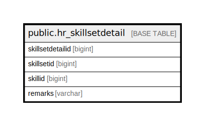

# public.hr_skillsetdetail

## Description

## Columns

| Name | Type | Default | Nullable | Children | Parents | Comment |
| ---- | ---- | ------- | -------- | -------- | ------- | ------- |
| skillsetdetailid | bigint | nextval('hr_skillsetdetail_skillsetdetailid_seq'::regclass) | false |  |  |  |
| skillsetid | bigint |  | false |  |  |  |
| skillid | bigint |  | true |  |  |  |
| remarks | varchar |  | true |  |  |  |

## Constraints

| Name | Type | Definition |
| ---- | ---- | ---------- |
| hr_skillsetdetail_pkey | PRIMARY KEY | PRIMARY KEY (skillsetdetailid) |

## Indexes

| Name | Definition |
| ---- | ---------- |
| hr_skillsetdetail_pkey | CREATE UNIQUE INDEX hr_skillsetdetail_pkey ON public.hr_skillsetdetail USING btree (skillsetdetailid) |

## Relations

---

> Generated by [tbls](https://github.com/k1LoW/tbls)
