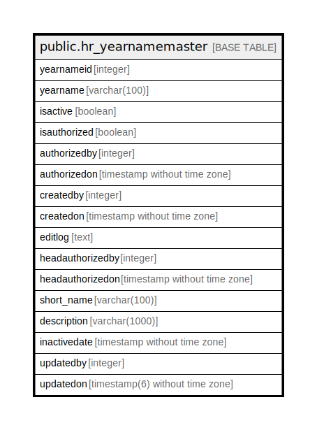

# public.hr_yearnamemaster

## Description

## Columns

| Name | Type | Default | Nullable | Children | Parents | Comment |
| ---- | ---- | ------- | -------- | -------- | ------- | ------- |
| yearnameid | integer | nextval('hr_yearnamemaster_yearnameid_seq'::regclass) | false |  |  |  |
| yearname | varchar(100) |  | false |  |  |  |
| isactive | boolean | false | false |  |  |  |
| isauthorized | boolean | false | false |  |  |  |
| authorizedby | integer |  | true |  |  |  |
| authorizedon | timestamp without time zone |  | true |  |  |  |
| createdby | integer |  | true |  |  |  |
| createdon | timestamp without time zone | now() | true |  |  |  |
| editlog | text |  | true |  |  |  |
| headauthorizedby | integer |  | true |  |  |  |
| headauthorizedon | timestamp without time zone |  | true |  |  |  |
| short_name | varchar(100) |  | true |  |  |  |
| description | varchar(1000) |  | true |  |  |  |
| inactivedate | timestamp without time zone |  | true |  |  |  |
| updatedby | integer |  | true |  |  |  |
| updatedon | timestamp(6) without time zone | NULL::timestamp without time zone | true |  |  |  |

## Constraints

| Name | Type | Definition |
| ---- | ---- | ---------- |
| yearnamemaster_department_key | UNIQUE | UNIQUE (yearname) |
| yearnamemaster_pkey | PRIMARY KEY | PRIMARY KEY (yearnameid) |

## Indexes

| Name | Definition |
| ---- | ---------- |
| yearnamemaster_department_key | CREATE UNIQUE INDEX yearnamemaster_department_key ON public.hr_yearnamemaster USING btree (yearname) |
| yearnamemaster_pkey | CREATE UNIQUE INDEX yearnamemaster_pkey ON public.hr_yearnamemaster USING btree (yearnameid) |

## Relations

---

> Generated by [tbls](https://github.com/k1LoW/tbls)
