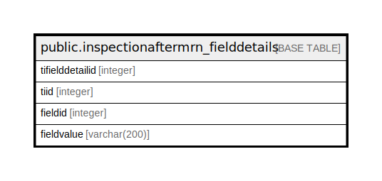

# public.inspectionaftermrn_fielddetails

## Description

## Columns

| Name | Type | Default | Nullable | Children | Parents | Comment |
| ---- | ---- | ------- | -------- | -------- | ------- | ------- |
| tifielddetailid | integer | nextval('inspectionaftermrn_fielddetails_tifielddetailid_seq'::regclass) | false |  |  |  |
| tiid | integer |  | true |  |  |  |
| fieldid | integer |  | true |  |  |  |
| fieldvalue | varchar(200) |  | true |  |  |  |

## Constraints

| Name | Type | Definition |
| ---- | ---- | ---------- |
| inspectionaftermrn_pkey | PRIMARY KEY | PRIMARY KEY (tifielddetailid) |

## Indexes

| Name | Definition |
| ---- | ---------- |
| inspectionaftermrn_pkey | CREATE UNIQUE INDEX inspectionaftermrn_pkey ON public.inspectionaftermrn_fielddetails USING btree (tifielddetailid) |

## Relations

---

> Generated by [tbls](https://github.com/k1LoW/tbls)
