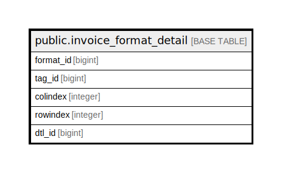

# public.invoice_format_detail

## Description

## Columns

| Name | Type | Default | Nullable | Children | Parents | Comment |
| ---- | ---- | ------- | -------- | -------- | ------- | ------- |
| format_id | bigint |  | true |  |  |  |
| tag_id | bigint |  | true |  |  |  |
| colindex | integer |  | true |  |  |  |
| rowindex | integer |  | true |  |  |  |
| dtl_id | bigint | nextval('invoice_format_detail_dtl_id_seq'::regclass) | false |  |  |  |

## Relations

---

> Generated by [tbls](https://github.com/k1LoW/tbls)
