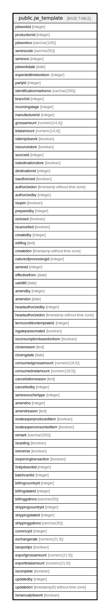

# public.jw_template

## Description

## Columns

| Name | Type | Default | Nullable | Children | Parents | Comment |
| ---- | ---- | ------- | -------- | -------- | ------- | ------- |
| jobworkid | integer | nextval('jw_template_jobworkid_seq'::regclass) | false |  |  |  |
| productionid | integer |  | true |  |  |  |
| jobworkno | varchar(100) |  | true |  |  |  |
| seriescode | varchar(50) |  | true |  |  |  |
| seriesno | integer |  | true |  |  |  |
| jobworkdate | date |  | true |  |  |  |
| expectedtimetoreturn | integer |  | true |  |  |  |
| partyid | integer |  | true |  |  |  |
| identificationmarkorno | varchar(200) |  | true |  |  |  |
| branchid | integer |  | true |  |  |  |
| incomingstage | integer |  | true |  |  |  |
| manufacturerid | integer |  | true |  |  |  |
| grossamount | numeric(14,4) |  | true |  |  |  |
| totalamount | numeric(14,4) |  | true |  |  |  |
| isitemjobwork | boolean |  | true |  |  |  |
| issourcestore | boolean | false | true |  |  |  |
| sourceid | integer |  | true |  |  |  |
| isdestinationstore | boolean |  | true |  |  |  |
| destinationid | integer |  | true |  |  |  |
| isauthorized | boolean | false | false |  |  |  |
| authorizedon | timestamp without time zone |  | true |  |  |  |
| authorizedby | integer |  | true |  |  |  |
| isopen | boolean | false | true |  |  |  |
| preparedby | integer |  | true |  |  |  |
| isclosed | boolean | false | true |  |  |  |
| iscancelled | boolean | false | true |  |  |  |
| createdby | integer |  | true |  |  |  |
| editlog | text |  | true |  |  |  |
| createdon | timestamp without time zone | now() | true |  |  |  |
| natureofprocessingid | integer |  | true |  |  |  |
| seriesid | integer |  | true |  |  |  |
| effectivefrom | date |  | true |  |  |  |
| validtill | date |  | true |  |  |  |
| amendby | integer |  | true |  |  |  |
| amendon | date |  | true |  |  |  |
| headauthorizedby | integer |  | true |  |  |  |
| headauthorizedon | timestamp without time zone |  | true |  |  |  |
| termconditiontemplateid | integer |  | true |  |  |  |
| isgatepasscreated | boolean | false | true |  |  |  |
| isconsumptionbasedonbom | boolean | false | true |  |  |  |
| closereason | text |  | true |  |  |  |
| closingdate | date |  | true |  |  |  |
| consumedgrossamount | numeric(18,5) |  | true |  |  |  |
| consumednetamount | numeric(18,5) |  | true |  |  |  |
| cancellationreason | text |  | true |  |  |  |
| cancelledby | integer |  | true |  |  |  |
| seriesvouchertype | integer |  | true |  |  |  |
| amendno | integer |  | true |  |  |  |
| amendreason | text |  | true |  |  |  |
| israteasperproduceditem | boolean | false | true |  |  |  |
| israteasperconsumeditem | boolean | false | true |  |  |  |
| remark | varchar(200) |  | true |  |  |  |
| iscasting | boolean | false | true |  |  |  |
| isreverse | boolean | false | true |  |  |  |
| isopeningtransaction | boolean | false | false |  |  |  |
| linkjobworkid | integer | 0 | false |  |  |  |
| batchcardid | integer |  | true |  |  |  |
| billingcountryid | integer |  | true |  |  |  |
| billingstateid | integer |  | true |  |  |  |
| billinggstinno | varchar(30) |  | true |  |  |  |
| shippingcountryid | integer |  | true |  |  |  |
| shippingstateid | integer |  | true |  |  |  |
| shippinggstinno | varchar(30) |  | true |  |  |  |
| currencyid | integer |  | true |  |  |  |
| exchangerate | numeric(21,9) |  | true |  |  |  |
| isexportpo | boolean | false | true |  |  |  |
| exportgrossamount | numeric(21,9) |  | true |  |  |  |
| exporttotalamount | numeric(21,9) |  | true |  |  |  |
| iscomplete | boolean | false | true |  |  |  |
| updatedby | integer |  | true |  |  |  |
| updatedon | timestamp(6) without time zone | NULL::timestamp without time zone | true |  |  |  |
| ismanualjobwork | boolean | false | true |  |  |  |

## Constraints

| Name | Type | Definition |
| ---- | ---- | ---------- |
| jw_template_pkey | PRIMARY KEY | PRIMARY KEY (jobworkid) |

## Indexes

| Name | Definition |
| ---- | ---------- |
| jw_template_pkey | CREATE UNIQUE INDEX jw_template_pkey ON public.jw_template USING btree (jobworkid) |
| ui_jworder_no | CREATE UNIQUE INDEX ui_jworder_no ON public.jw_template USING btree (jobworkno, jobworkdate, branchid, seriesvouchertype, isclosed) WHERE (jobworkid > 0) |

## Triggers

| Name | Definition |
| ---- | ---------- |
| jobworkorder_amend_log_entry | CREATE TRIGGER jobworkorder_amend_log_entry BEFORE UPDATE ON public.jw_template FOR EACH ROW EXECUTE FUNCTION jobworkorder_amend_log_entry() |

## Relations

---

> Generated by [tbls](https://github.com/k1LoW/tbls)
