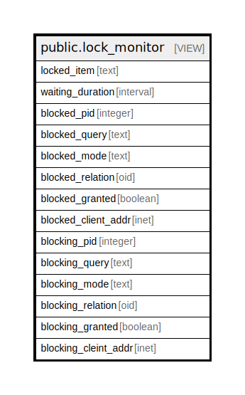

# public.lock_monitor

## Description

<details>
<summary><strong>Table Definition</strong></summary>

```sql
CREATE VIEW lock_monitor AS (
 SELECT COALESCE(((blockingl.relation)::regclass)::text, blockingl.locktype) AS locked_item,
    (now() - blockeda.query_start) AS waiting_duration,
    blockeda.pid AS blocked_pid,
    blockeda.query AS blocked_query,
    blockedl.mode AS blocked_mode,
    blockedl.relation AS blocked_relation,
    blockedl.granted AS blocked_granted,
    blockeda.client_addr AS blocked_client_addr,
    blockinga.pid AS blocking_pid,
    blockinga.query AS blocking_query,
    blockingl.mode AS blocking_mode,
    blockingl.relation AS blocking_relation,
    blockingl.granted AS blocking_granted,
    blockinga.client_addr AS blocking_cleint_addr
   FROM (((pg_locks blockedl
     JOIN pg_stat_activity blockeda ON ((blockedl.pid = blockeda.pid)))
     JOIN pg_locks blockingl ON ((((blockingl.transactionid = blockedl.transactionid) OR ((blockingl.relation = blockedl.relation) AND (blockingl.locktype = blockedl.locktype))) AND (blockedl.pid <> blockingl.pid))))
     JOIN pg_stat_activity blockinga ON (((blockingl.pid = blockinga.pid) AND (blockinga.datid = blockeda.datid))))
  WHERE ((NOT blockedl.granted) AND (blockinga.datname = current_database()))
)
```

</details>

## Columns

| Name | Type | Default | Nullable | Children | Parents | Comment |
| ---- | ---- | ------- | -------- | -------- | ------- | ------- |
| locked_item | text |  | true |  |  |  |
| waiting_duration | interval |  | true |  |  |  |
| blocked_pid | integer |  | true |  |  |  |
| blocked_query | text |  | true |  |  |  |
| blocked_mode | text |  | true |  |  |  |
| blocked_relation | oid |  | true |  |  |  |
| blocked_granted | boolean |  | true |  |  |  |
| blocked_client_addr | inet |  | true |  |  |  |
| blocking_pid | integer |  | true |  |  |  |
| blocking_query | text |  | true |  |  |  |
| blocking_mode | text |  | true |  |  |  |
| blocking_relation | oid |  | true |  |  |  |
| blocking_granted | boolean |  | true |  |  |  |
| blocking_cleint_addr | inet |  | true |  |  |  |

## Referenced Tables

| Name | Columns | Comment | Type |
| ---- | ------- | ------- | ---- |
| [pg_locks](pg_locks.md) | 0 |  |  |
| [pg_stat_activity](pg_stat_activity.md) | 0 |  |  |

## Relations



---

> Generated by [tbls](https://github.com/k1LoW/tbls)
