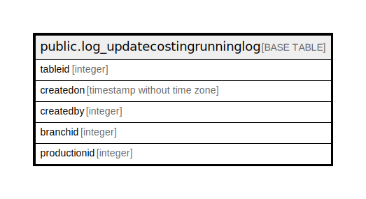

# public.log_updatecostingrunninglog

## Description

## Columns

| Name | Type | Default | Nullable | Children | Parents | Comment |
| ---- | ---- | ------- | -------- | -------- | ------- | ------- |
| tableid | integer | nextval('log_updatecostingrunninglog_tableid_seq'::regclass) | false |  |  |  |
| createdon | timestamp without time zone |  | true |  |  |  |
| createdby | integer |  | true |  |  |  |
| branchid | integer |  | true |  |  |  |
| productionid | integer |  | true |  |  |  |

## Constraints

| Name | Type | Definition |
| ---- | ---- | ---------- |
| log_updatecostingrunninglog_pkey | PRIMARY KEY | PRIMARY KEY (tableid) |

## Indexes

| Name | Definition |
| ---- | ---------- |
| log_updatecostingrunninglog_pkey | CREATE UNIQUE INDEX log_updatecostingrunninglog_pkey ON public.log_updatecostingrunninglog USING btree (tableid) |

## Relations

---

> Generated by [tbls](https://github.com/k1LoW/tbls)
