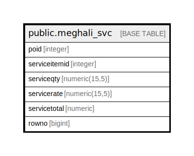

# public.meghali_svc

## Description

## Columns

| Name | Type | Default | Nullable | Children | Parents | Comment |
| ---- | ---- | ------- | -------- | -------- | ------- | ------- |
| poid | integer |  | true |  |  |  |
| serviceitemid | integer |  | true |  |  |  |
| serviceqty | numeric(15,5) |  | true |  |  |  |
| servicerate | numeric(15,5) |  | true |  |  |  |
| servicetotal | numeric |  | true |  |  |  |
| rowno | bigint |  | true |  |  |  |

## Relations

---

> Generated by [tbls](https://github.com/k1LoW/tbls)
