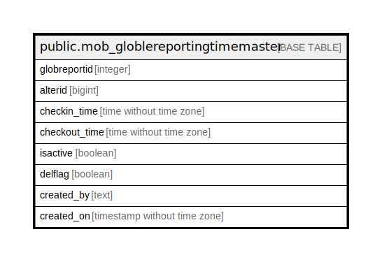

# public.mob_globlereportingtimemaster

## Description

## Columns

| Name | Type | Default | Nullable | Children | Parents | Comment |
| ---- | ---- | ------- | -------- | -------- | ------- | ------- |
| globreportid | integer | nextval('mob_globlereportingtimemaster_globreportid_seq'::regclass) | false |  |  |  |
| alterid | bigint |  | true |  |  |  |
| checkin_time | time without time zone |  | true |  |  |  |
| checkout_time | time without time zone |  | true |  |  |  |
| isactive | boolean |  | true |  |  |  |
| delflag | boolean |  | true |  |  |  |
| created_by | text |  | true |  |  |  |
| created_on | timestamp without time zone | now() | true |  |  |  |

## Relations

---

> Generated by [tbls](https://github.com/k1LoW/tbls)
