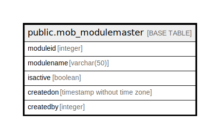

# public.mob_modulemaster

## Description

## Columns

| Name | Type | Default | Nullable | Children | Parents | Comment |
| ---- | ---- | ------- | -------- | -------- | ------- | ------- |
| moduleid | integer | nextval('mob_modulemaster_moduleid_seq'::regclass) | false |  |  |  |
| modulename | varchar(50) |  | true |  |  |  |
| isactive | boolean | true | true |  |  |  |
| createdon | timestamp without time zone | now() | true |  |  |  |
| createdby | integer |  | true |  |  |  |

## Relations

---

> Generated by [tbls](https://github.com/k1LoW/tbls)
