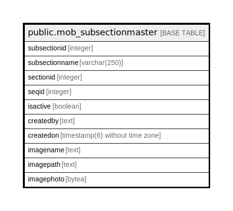

# public.mob_subsectionmaster

## Description

## Columns

| Name | Type | Default | Nullable | Children | Parents | Comment |
| ---- | ---- | ------- | -------- | -------- | ------- | ------- |
| subsectionid | integer | nextval('mob_subsectionmaster_subsectionid_seq'::regclass) | false |  |  |  |
| subsectionname | varchar(250) |  | true |  |  |  |
| sectionid | integer |  | true |  |  |  |
| seqid | integer |  | true |  |  |  |
| isactive | boolean | false | true |  |  |  |
| createdby | text |  | true |  |  |  |
| createdon | timestamp(6) without time zone | now() | true |  |  |  |
| imagename | text |  | true |  |  |  |
| imagepath | text |  | true |  |  |  |
| imagephoto | bytea |  | true |  |  |  |

## Constraints

| Name | Type | Definition |
| ---- | ---- | ---------- |
| mob_subsectionmaster_pkey | PRIMARY KEY | PRIMARY KEY (subsectionid) |

## Indexes

| Name | Definition |
| ---- | ---------- |
| mob_subsectionmaster_pkey | CREATE UNIQUE INDEX mob_subsectionmaster_pkey ON public.mob_subsectionmaster USING btree (subsectionid) |

## Relations

---

> Generated by [tbls](https://github.com/k1LoW/tbls)
