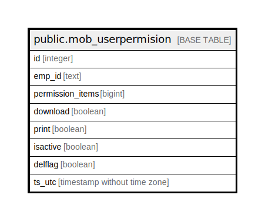

# public.mob_userpermision

## Description

## Columns

| Name | Type | Default | Nullable | Children | Parents | Comment |
| ---- | ---- | ------- | -------- | -------- | ------- | ------- |
| id | integer | nextval('mob_userpermision_id_seq'::regclass) | false |  |  |  |
| emp_id | text |  | true |  |  |  |
| permission_items | bigint |  | true |  |  |  |
| download | boolean |  | true |  |  |  |
| print | boolean |  | true |  |  |  |
| isactive | boolean |  | true |  |  |  |
| delflag | boolean | false | true |  |  |  |
| ts_utc | timestamp without time zone |  | true |  |  |  |

## Relations

---

> Generated by [tbls](https://github.com/k1LoW/tbls)
