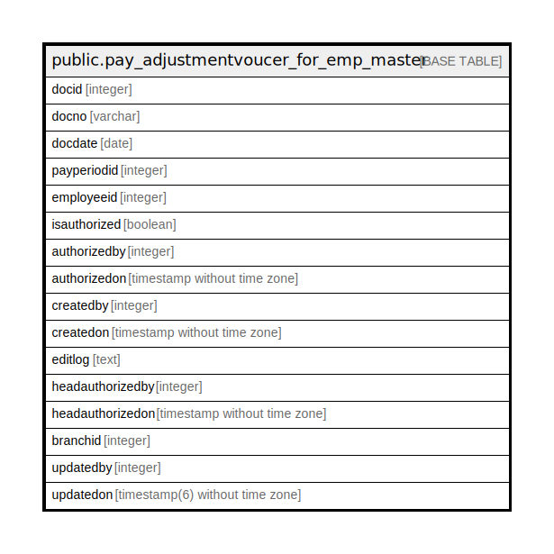

# public.pay_adjustmentvoucer_for_emp_master

## Description

## Columns

| Name | Type | Default | Nullable | Children | Parents | Comment |
| ---- | ---- | ------- | -------- | -------- | ------- | ------- |
| docid | integer | nextval('pay_adjustmentvoucer_for_emp_master_docid_seq'::regclass) | false |  |  |  |
| docno | varchar |  | false |  |  |  |
| docdate | date |  | false |  |  |  |
| payperiodid | integer |  | false |  |  |  |
| employeeid | integer |  | false |  |  |  |
| isauthorized | boolean | false | false |  |  |  |
| authorizedby | integer |  | true |  |  |  |
| authorizedon | timestamp without time zone |  | true |  |  |  |
| createdby | integer |  | true |  |  |  |
| createdon | timestamp without time zone | now() | true |  |  |  |
| editlog | text |  | true |  |  |  |
| headauthorizedby | integer |  | true |  |  |  |
| headauthorizedon | timestamp without time zone |  | true |  |  |  |
| branchid | integer |  | true |  |  |  |
| updatedby | integer |  | true |  |  |  |
| updatedon | timestamp(6) without time zone | NULL::timestamp without time zone | true |  |  |  |

## Relations

---

> Generated by [tbls](https://github.com/k1LoW/tbls)
