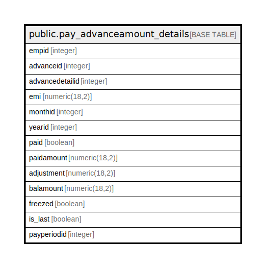

# public.pay_advanceamount_details

## Description

## Columns

| Name | Type | Default | Nullable | Children | Parents | Comment |
| ---- | ---- | ------- | -------- | -------- | ------- | ------- |
| empid | integer |  | true |  |  |  |
| advanceid | integer |  | false |  |  |  |
| advancedetailid | integer | nextval('pay_advanceamount_details_advancedetailid_seq'::regclass) | false |  |  |  |
| emi | numeric(18,2) |  | true |  |  |  |
| monthid | integer |  | true |  |  |  |
| yearid | integer |  | true |  |  |  |
| paid | boolean |  | true |  |  |  |
| paidamount | numeric(18,2) |  | true |  |  |  |
| adjustment | numeric(18,2) |  | true |  |  |  |
| balamount | numeric(18,2) |  | true |  |  |  |
| freezed | boolean |  | true |  |  |  |
| is_last | boolean |  | true |  |  |  |
| payperiodid | integer |  | true |  |  |  |

## Constraints

| Name | Type | Definition |
| ---- | ---- | ---------- |
| pay_advanceamount_details_pkey | PRIMARY KEY | PRIMARY KEY (advancedetailid) |

## Indexes

| Name | Definition |
| ---- | ---------- |
| pay_advanceamount_details_pkey | CREATE UNIQUE INDEX pay_advanceamount_details_pkey ON public.pay_advanceamount_details USING btree (advancedetailid) |

## Relations

---

> Generated by [tbls](https://github.com/k1LoW/tbls)
