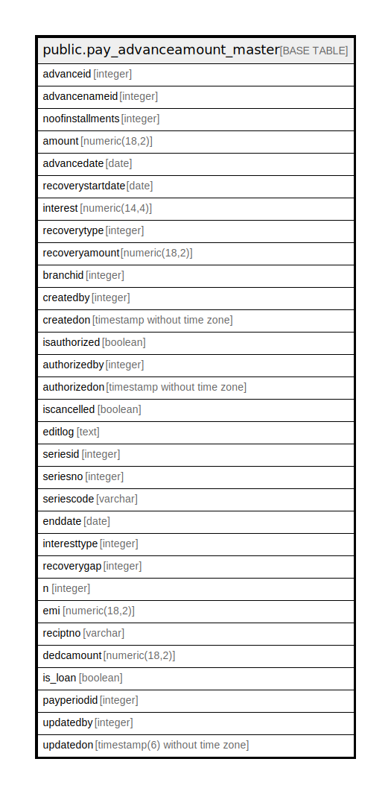

# public.pay_advanceamount_master

## Description

## Columns

| Name | Type | Default | Nullable | Children | Parents | Comment |
| ---- | ---- | ------- | -------- | -------- | ------- | ------- |
| advanceid | integer | nextval('pay_advanceamount_master_advanceid_seq'::regclass) | false |  |  |  |
| advancenameid | integer |  | true |  |  |  |
| noofinstallments | integer |  | true |  |  |  |
| amount | numeric(18,2) |  | true |  |  |  |
| advancedate | date |  | true |  |  |  |
| recoverystartdate | date |  | true |  |  |  |
| interest | numeric(14,4) |  | true |  |  |  |
| recoverytype | integer |  | true |  |  |  |
| recoveryamount | numeric(18,2) |  | true |  |  |  |
| branchid | integer |  | true |  |  |  |
| createdby | integer |  | true |  |  |  |
| createdon | timestamp without time zone | now() | true |  |  |  |
| isauthorized | boolean | false | false |  |  |  |
| authorizedby | integer |  | true |  |  |  |
| authorizedon | timestamp without time zone |  | true |  |  |  |
| iscancelled | boolean | false | false |  |  |  |
| editlog | text |  | true |  |  |  |
| seriesid | integer |  | true |  |  |  |
| seriesno | integer |  | true |  |  |  |
| seriescode | varchar |  | true |  |  |  |
| enddate | date |  | true |  |  |  |
| interesttype | integer |  | true |  |  |  |
| recoverygap | integer |  | true |  |  |  |
| n | integer |  | true |  |  |  |
| emi | numeric(18,2) |  | true |  |  |  |
| reciptno | varchar |  | true |  |  |  |
| dedcamount | numeric(18,2) |  | true |  |  |  |
| is_loan | boolean |  | true |  |  |  |
| payperiodid | integer |  | true |  |  |  |
| updatedby | integer |  | true |  |  |  |
| updatedon | timestamp(6) without time zone | NULL::timestamp without time zone | true |  |  |  |

## Constraints

| Name | Type | Definition |
| ---- | ---- | ---------- |
| pay_advanceamount_master_pkey | PRIMARY KEY | PRIMARY KEY (advanceid) |

## Indexes

| Name | Definition |
| ---- | ---------- |
| pay_advanceamount_master_pkey | CREATE UNIQUE INDEX pay_advanceamount_master_pkey ON public.pay_advanceamount_master USING btree (advanceid) |

## Relations

---

> Generated by [tbls](https://github.com/k1LoW/tbls)
