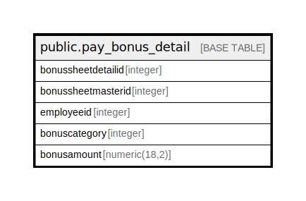

# public.pay_bonus_detail

## Description

## Columns

| Name | Type | Default | Nullable | Children | Parents | Comment |
| ---- | ---- | ------- | -------- | -------- | ------- | ------- |
| bonussheetdetailid | integer | nextval('pay_bonus_detail_bonussheetdetailid_seq'::regclass) | false |  |  |  |
| bonussheetmasterid | integer |  | true |  |  |  |
| employeeid | integer |  | true |  |  |  |
| bonuscategory | integer |  | true |  |  |  |
| bonusamount | numeric(18,2) |  | true |  |  |  |

## Constraints

| Name | Type | Definition |
| ---- | ---- | ---------- |
| pay_bonus_detail_pkey | PRIMARY KEY | PRIMARY KEY (bonussheetdetailid) |

## Indexes

| Name | Definition |
| ---- | ---------- |
| pay_bonus_detail_pkey | CREATE UNIQUE INDEX pay_bonus_detail_pkey ON public.pay_bonus_detail USING btree (bonussheetdetailid) |

## Relations

---

> Generated by [tbls](https://github.com/k1LoW/tbls)
