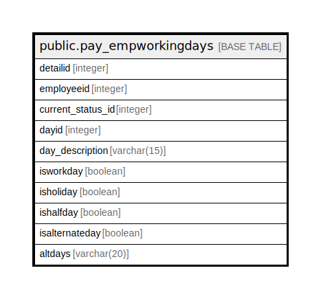

# public.pay_empworkingdays

## Description

## Columns

| Name | Type | Default | Nullable | Children | Parents | Comment |
| ---- | ---- | ------- | -------- | -------- | ------- | ------- |
| detailid | integer | nextval('pay_empworkingdays_detailid_seq'::regclass) | false |  |  |  |
| employeeid | integer |  | true |  |  |  |
| current_status_id | integer |  | true |  |  |  |
| dayid | integer |  | true |  |  |  |
| day_description | varchar(15) | NULL::character varying | true |  |  |  |
| isworkday | boolean | false | true |  |  |  |
| isholiday | boolean | false | true |  |  |  |
| ishalfday | boolean | false | true |  |  |  |
| isalternateday | boolean | false | true |  |  |  |
| altdays | varchar(20) | NULL::character varying | true |  |  |  |

## Constraints

| Name | Type | Definition |
| ---- | ---- | ---------- |
| pay_empworkingdays_pkey | PRIMARY KEY | PRIMARY KEY (detailid) |

## Indexes

| Name | Definition |
| ---- | ---------- |
| pay_empworkingdays_pkey | CREATE UNIQUE INDEX pay_empworkingdays_pkey ON public.pay_empworkingdays USING btree (detailid) |

## Relations

---

> Generated by [tbls](https://github.com/k1LoW/tbls)
