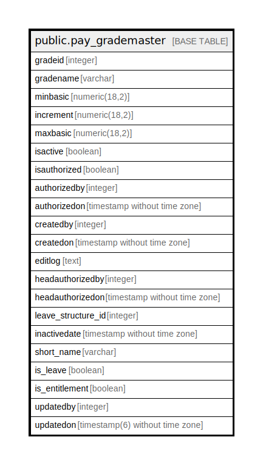

# public.pay_grademaster

## Description

## Columns

| Name | Type | Default | Nullable | Children | Parents | Comment |
| ---- | ---- | ------- | -------- | -------- | ------- | ------- |
| gradeid | integer | nextval('pay_grademaster_gradeid_seq'::regclass) | false |  |  |  |
| gradename | varchar |  | true |  |  |  |
| minbasic | numeric(18,2) |  | true |  |  |  |
| increment | numeric(18,2) |  | true |  |  |  |
| maxbasic | numeric(18,2) |  | true |  |  |  |
| isactive | boolean |  | true |  |  |  |
| isauthorized | boolean |  | true |  |  |  |
| authorizedby | integer |  | true |  |  |  |
| authorizedon | timestamp without time zone |  | true |  |  |  |
| createdby | integer |  | true |  |  |  |
| createdon | timestamp without time zone | now() | true |  |  |  |
| editlog | text |  | true |  |  |  |
| headauthorizedby | integer |  | true |  |  |  |
| headauthorizedon | timestamp without time zone |  | true |  |  |  |
| leave_structure_id | integer |  | true |  |  |  |
| inactivedate | timestamp without time zone |  | true |  |  |  |
| short_name | varchar |  | true |  |  |  |
| is_leave | boolean |  | true |  |  |  |
| is_entitlement | boolean |  | true |  |  |  |
| updatedby | integer |  | true |  |  |  |
| updatedon | timestamp(6) without time zone | NULL::timestamp without time zone | true |  |  |  |

## Constraints

| Name | Type | Definition |
| ---- | ---- | ---------- |
| code | UNIQUE | UNIQUE (short_name) |
| gradename | UNIQUE | UNIQUE (gradename) |
| hr_grademaster_pkey | PRIMARY KEY | PRIMARY KEY (gradeid) |

## Indexes

| Name | Definition |
| ---- | ---------- |
| code | CREATE UNIQUE INDEX code ON public.pay_grademaster USING btree (short_name) |
| gradename | CREATE UNIQUE INDEX gradename ON public.pay_grademaster USING btree (gradename) |
| hr_grademaster_pkey | CREATE UNIQUE INDEX hr_grademaster_pkey ON public.pay_grademaster USING btree (gradeid) |
| uq_gradename | CREATE UNIQUE INDEX uq_gradename ON public.pay_grademaster USING btree (lower((gradename)::text)) |

## Relations

---

> Generated by [tbls](https://github.com/k1LoW/tbls)
