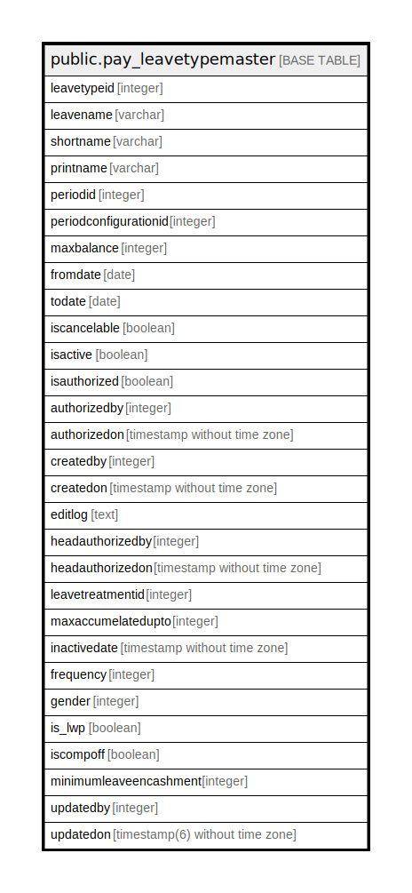

# public.pay_leavetypemaster

## Description

## Columns

| Name | Type | Default | Nullable | Children | Parents | Comment |
| ---- | ---- | ------- | -------- | -------- | ------- | ------- |
| leavetypeid | integer | nextval('pay_leavetypemaster_leavetypeid_seq'::regclass) | false |  |  |  |
| leavename | varchar |  | true |  |  |  |
| shortname | varchar |  | true |  |  |  |
| printname | varchar |  | true |  |  |  |
| periodid | integer |  | true |  |  |  |
| periodconfigurationid | integer |  | true |  |  |  |
| maxbalance | integer |  | true |  |  |  |
| fromdate | date |  | true |  |  |  |
| todate | date |  | true |  |  |  |
| iscancelable | boolean |  | true |  |  |  |
| isactive | boolean |  | true |  |  |  |
| isauthorized | boolean |  | true |  |  |  |
| authorizedby | integer |  | true |  |  |  |
| authorizedon | timestamp without time zone |  | true |  |  |  |
| createdby | integer |  | true |  |  |  |
| createdon | timestamp without time zone | now() | true |  |  |  |
| editlog | text |  | true |  |  |  |
| headauthorizedby | integer |  | true |  |  |  |
| headauthorizedon | timestamp without time zone |  | true |  |  |  |
| leavetreatmentid | integer |  | true |  |  |  |
| maxaccumelatedupto | integer |  | true |  |  |  |
| inactivedate | timestamp without time zone |  | true |  |  |  |
| frequency | integer |  | true |  |  |  |
| gender | integer |  | true |  |  |  |
| is_lwp | boolean |  | true |  |  |  |
| iscompoff | boolean |  | true |  |  |  |
| minimumleaveencashment | integer |  | true |  |  |  |
| updatedby | integer |  | true |  |  |  |
| updatedon | timestamp(6) without time zone | NULL::timestamp without time zone | true |  |  |  |

## Constraints

| Name | Type | Definition |
| ---- | ---- | ---------- |
| leavename | UNIQUE | UNIQUE (leavename) |
| pay_leavetypemaster_pkey | PRIMARY KEY | PRIMARY KEY (leavetypeid) |
| printname | UNIQUE | UNIQUE (printname) |

## Indexes

| Name | Definition |
| ---- | ---------- |
| leavename | CREATE UNIQUE INDEX leavename ON public.pay_leavetypemaster USING btree (leavename) |
| pay_leavetypemaster_pkey | CREATE UNIQUE INDEX pay_leavetypemaster_pkey ON public.pay_leavetypemaster USING btree (leavetypeid) |
| printname | CREATE UNIQUE INDEX printname ON public.pay_leavetypemaster USING btree (printname) |
| unique_shortname | CREATE UNIQUE INDEX unique_shortname ON public.pay_leavetypemaster USING btree (lower((shortname)::text)) |

## Relations

---

> Generated by [tbls](https://github.com/k1LoW/tbls)
