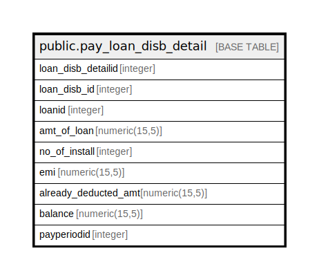

# public.pay_loan_disb_detail

## Description

## Columns

| Name | Type | Default | Nullable | Children | Parents | Comment |
| ---- | ---- | ------- | -------- | -------- | ------- | ------- |
| loan_disb_detailid | integer | nextval('pay_loan_disb_detail_loan_disb_detailid_seq1'::regclass) | false |  |  |  |
| loan_disb_id | integer |  | false |  |  |  |
| loanid | integer |  | false |  |  |  |
| amt_of_loan | numeric(15,5) |  | true |  |  |  |
| no_of_install | integer |  | true |  |  |  |
| emi | numeric(15,5) |  | true |  |  |  |
| already_deducted_amt | numeric(15,5) |  | true |  |  |  |
| balance | numeric(15,5) |  | true |  |  |  |
| payperiodid | integer |  | false |  |  |  |

## Constraints

| Name | Type | Definition |
| ---- | ---- | ---------- |
| pay_loan_disb_detail_pkey | PRIMARY KEY | PRIMARY KEY (loan_disb_detailid) |

## Indexes

| Name | Definition |
| ---- | ---------- |
| pay_loan_disb_detail_pkey | CREATE UNIQUE INDEX pay_loan_disb_detail_pkey ON public.pay_loan_disb_detail USING btree (loan_disb_detailid) |

## Relations

---

> Generated by [tbls](https://github.com/k1LoW/tbls)
