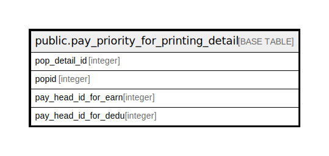

# public.pay_priority_for_printing_detail

## Description

## Columns

| Name | Type | Default | Nullable | Children | Parents | Comment |
| ---- | ---- | ------- | -------- | -------- | ------- | ------- |
| pop_detail_id | integer | nextval('pay_priority_for_printing_detail_pop_detail_id_seq'::regclass) | false |  |  |  |
| popid | integer |  | false |  |  |  |
| pay_head_id_for_earn | integer |  | true |  |  |  |
| pay_head_id_for_dedu | integer |  | true |  |  |  |

## Relations

---

> Generated by [tbls](https://github.com/k1LoW/tbls)
