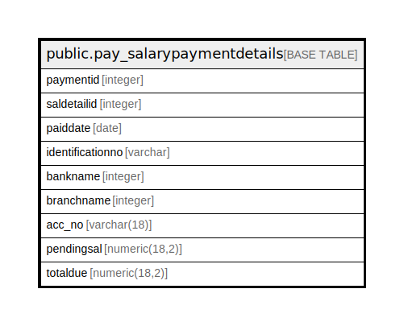

# public.pay_salarypaymentdetails

## Description

## Columns

| Name | Type | Default | Nullable | Children | Parents | Comment |
| ---- | ---- | ------- | -------- | -------- | ------- | ------- |
| paymentid | integer | nextval('pay_salarypaymentdetails_paymentid_seq'::regclass) | false |  |  |  |
| saldetailid | integer |  | false |  |  |  |
| paiddate | date |  | true |  |  |  |
| identificationno | varchar |  | true |  |  |  |
| bankname | integer |  | true |  |  |  |
| branchname | integer |  | true |  |  |  |
| acc_no | varchar(18) |  | true |  |  |  |
| pendingsal | numeric(18,2) |  | true |  |  |  |
| totaldue | numeric(18,2) |  | true |  |  |  |

## Constraints

| Name | Type | Definition |
| ---- | ---- | ---------- |
| pay_salarypaymentdetails_pkey | PRIMARY KEY | PRIMARY KEY (paymentid) |

## Indexes

| Name | Definition |
| ---- | ---------- |
| pay_salarypaymentdetails_pkey | CREATE UNIQUE INDEX pay_salarypaymentdetails_pkey ON public.pay_salarypaymentdetails USING btree (paymentid) |

## Relations

---

> Generated by [tbls](https://github.com/k1LoW/tbls)
