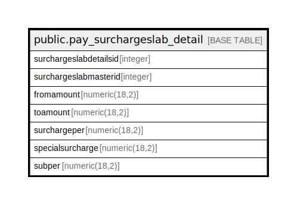

# public.pay_surchargeslab_detail

## Description

## Columns

| Name | Type | Default | Nullable | Children | Parents | Comment |
| ---- | ---- | ------- | -------- | -------- | ------- | ------- |
| surchargeslabdetailsid | integer | nextval('pay_surchargeslab_detail_surchargeslabdetailsid_seq'::regclass) | false |  |  |  |
| surchargeslabmasterid | integer |  | true |  |  |  |
| fromamount | numeric(18,2) |  | true |  |  |  |
| toamount | numeric(18,2) |  | true |  |  |  |
| surchargeper | numeric(18,2) |  | true |  |  |  |
| specialsurcharge | numeric(18,2) |  | true |  |  |  |
| subper | numeric(18,2) |  | true |  |  |  |

## Constraints

| Name | Type | Definition |
| ---- | ---- | ---------- |
| pay_surchargeslab_detail_pkey | PRIMARY KEY | PRIMARY KEY (surchargeslabdetailsid) |

## Indexes

| Name | Definition |
| ---- | ---------- |
| pay_surchargeslab_detail_pkey | CREATE UNIQUE INDEX pay_surchargeslab_detail_pkey ON public.pay_surchargeslab_detail USING btree (surchargeslabdetailsid) |

## Relations

---

> Generated by [tbls](https://github.com/k1LoW/tbls)
