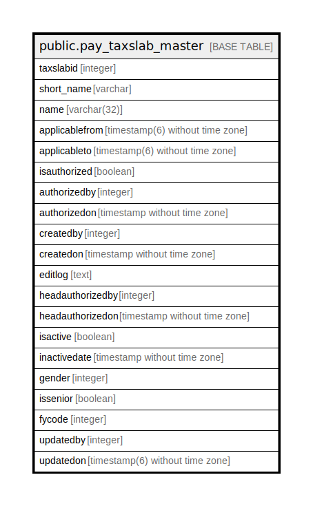

# public.pay_taxslab_master

## Description

## Columns

| Name | Type | Default | Nullable | Children | Parents | Comment |
| ---- | ---- | ------- | -------- | -------- | ------- | ------- |
| taxslabid | integer | nextval('pay_taxslab_master_taxslabid_seq'::regclass) | false |  |  |  |
| short_name | varchar |  | true |  |  |  |
| name | varchar(32) |  | true |  |  |  |
| applicablefrom | timestamp(6) without time zone |  | true |  |  |  |
| applicableto | timestamp(6) without time zone |  | true |  |  |  |
| isauthorized | boolean |  | true |  |  |  |
| authorizedby | integer |  | true |  |  |  |
| authorizedon | timestamp without time zone |  | true |  |  |  |
| createdby | integer |  | true |  |  |  |
| createdon | timestamp without time zone | now() | true |  |  |  |
| editlog | text |  | true |  |  |  |
| headauthorizedby | integer |  | true |  |  |  |
| headauthorizedon | timestamp without time zone |  | true |  |  |  |
| isactive | boolean | false | true |  |  |  |
| inactivedate | timestamp without time zone |  | true |  |  |  |
| gender | integer |  | true |  |  |  |
| issenior | boolean |  | true |  |  |  |
| fycode | integer |  | true |  |  |  |
| updatedby | integer |  | true |  |  |  |
| updatedon | timestamp(6) without time zone | NULL::timestamp without time zone | true |  |  |  |

## Constraints

| Name | Type | Definition |
| ---- | ---- | ---------- |
| pay_taxslab_master_code | UNIQUE | UNIQUE (short_name) |
| pay_taxslab_master_pkey | PRIMARY KEY | PRIMARY KEY (taxslabid) |

## Indexes

| Name | Definition |
| ---- | ---------- |
| pay_taxslab_master_code | CREATE UNIQUE INDEX pay_taxslab_master_code ON public.pay_taxslab_master USING btree (short_name) |
| pay_taxslab_master_pkey | CREATE UNIQUE INDEX pay_taxslab_master_pkey ON public.pay_taxslab_master USING btree (taxslabid) |

## Relations

---

> Generated by [tbls](https://github.com/k1LoW/tbls)
