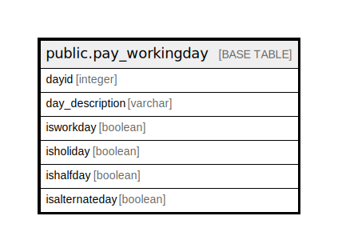

# public.pay_workingday

## Description

## Columns

| Name | Type | Default | Nullable | Children | Parents | Comment |
| ---- | ---- | ------- | -------- | -------- | ------- | ------- |
| dayid | integer | nextval('pay_workingday_dayid_seq'::regclass) | false |  |  |  |
| day_description | varchar |  | true |  |  |  |
| isworkday | boolean |  | true |  |  |  |
| isholiday | boolean |  | true |  |  |  |
| ishalfday | boolean |  | true |  |  |  |
| isalternateday | boolean |  | true |  |  |  |

## Constraints

| Name | Type | Definition |
| ---- | ---- | ---------- |
| pay_workingday_pkey | PRIMARY KEY | PRIMARY KEY (dayid) |

## Indexes

| Name | Definition |
| ---- | ---------- |
| pay_workingday_pkey | CREATE UNIQUE INDEX pay_workingday_pkey ON public.pay_workingday USING btree (dayid) |

## Relations

---

> Generated by [tbls](https://github.com/k1LoW/tbls)
