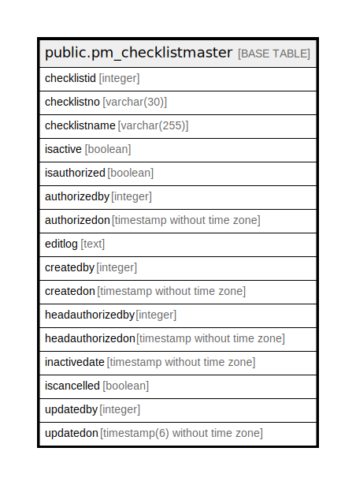

# public.pm_checklistmaster

## Description

## Columns

| Name | Type | Default | Nullable | Children | Parents | Comment |
| ---- | ---- | ------- | -------- | -------- | ------- | ------- |
| checklistid | integer | nextval('pm_checklistmaster_checklistid_seq'::regclass) | false |  |  |  |
| checklistno | varchar(30) |  | true |  |  |  |
| checklistname | varchar(255) |  | true |  |  |  |
| isactive | boolean | false | false |  |  |  |
| isauthorized | boolean | false | false |  |  |  |
| authorizedby | integer |  | true |  |  |  |
| authorizedon | timestamp without time zone |  | true |  |  |  |
| editlog | text |  | true |  |  |  |
| createdby | integer |  | true |  |  |  |
| createdon | timestamp without time zone | now() | true |  |  |  |
| headauthorizedby | integer |  | true |  |  |  |
| headauthorizedon | timestamp without time zone |  | true |  |  |  |
| inactivedate | timestamp without time zone |  | true |  |  |  |
| iscancelled | boolean | false | true |  |  |  |
| updatedby | integer |  | true |  |  |  |
| updatedon | timestamp(6) without time zone | NULL::timestamp without time zone | true |  |  |  |

## Constraints

| Name | Type | Definition |
| ---- | ---- | ---------- |
| Unique_checklistno | UNIQUE | UNIQUE (checklistno) |
| pm_checklistmaster_pkey | PRIMARY KEY | PRIMARY KEY (checklistid) |

## Indexes

| Name | Definition |
| ---- | ---------- |
| Unique_checklistno | CREATE UNIQUE INDEX "Unique_checklistno" ON public.pm_checklistmaster USING btree (checklistno) |
| pm_checklistmaster_pkey | CREATE UNIQUE INDEX pm_checklistmaster_pkey ON public.pm_checklistmaster USING btree (checklistid) |

## Relations

---

> Generated by [tbls](https://github.com/k1LoW/tbls)
