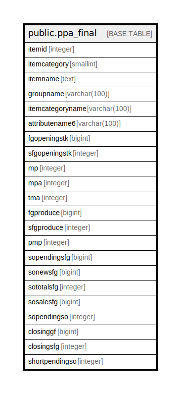

# public.ppa_final

## Description

## Columns

| Name | Type | Default | Nullable | Children | Parents | Comment |
| ---- | ---- | ------- | -------- | -------- | ------- | ------- |
| itemid | integer |  | true |  |  |  |
| itemcategory | smallint |  | true |  |  |  |
| itemname | text |  | true |  |  |  |
| groupname | varchar(100) |  | true |  |  |  |
| itemcategoryname | varchar(100) |  | true |  |  |  |
| attributename6 | varchar(100) |  | true |  |  |  |
| fgopeningstk | bigint |  | true |  |  |  |
| sfgopeningstk | integer |  | true |  |  |  |
| mp | integer |  | true |  |  |  |
| mpa | integer |  | true |  |  |  |
| tma | integer |  | true |  |  |  |
| fgproduce | bigint |  | true |  |  |  |
| sfgproduce | integer |  | true |  |  |  |
| pmp | integer |  | true |  |  |  |
| sopendingsfg | bigint |  | true |  |  |  |
| sonewsfg | bigint |  | true |  |  |  |
| sototalsfg | integer |  | true |  |  |  |
| sosalesfg | bigint |  | true |  |  |  |
| sopendingso | integer |  | true |  |  |  |
| closinggf | bigint |  | true |  |  |  |
| closingsfg | integer |  | true |  |  |  |
| shortpendingso | integer |  | true |  |  |  |

## Relations

---

> Generated by [tbls](https://github.com/k1LoW/tbls)
