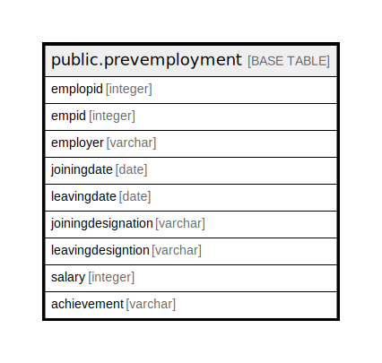

# public.prevemployment

## Description

## Columns

| Name | Type | Default | Nullable | Children | Parents | Comment |
| ---- | ---- | ------- | -------- | -------- | ------- | ------- |
| emplopid | integer | nextval('prevemployment_emplopid_seq'::regclass) | false |  |  |  |
| empid | integer |  | true |  |  |  |
| employer | varchar |  | true |  |  |  |
| joiningdate | date |  | true |  |  |  |
| leavingdate | date |  | true |  |  |  |
| joiningdesignation | varchar |  | true |  |  |  |
| leavingdesigntion | varchar |  | true |  |  |  |
| salary | integer |  | true |  |  |  |
| achievement | varchar |  | true |  |  |  |

## Relations

---

> Generated by [tbls](https://github.com/k1LoW/tbls)
