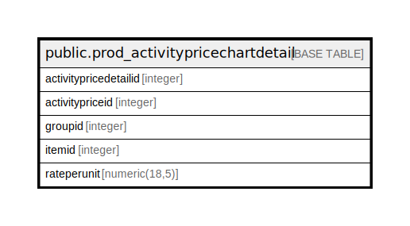

# public.prod_activitypricechartdetail

## Description

## Columns

| Name | Type | Default | Nullable | Children | Parents | Comment |
| ---- | ---- | ------- | -------- | -------- | ------- | ------- |
| activitypricedetailid | integer | nextval('prod_activitypricechartdetail_activitypricedetailid_seq'::regclass) | false |  |  |  |
| activitypriceid | integer |  | true |  |  |  |
| groupid | integer |  | true |  |  |  |
| itemid | integer |  | true |  |  |  |
| rateperunit | numeric(18,5) |  | true |  |  |  |

## Constraints

| Name | Type | Definition |
| ---- | ---- | ---------- |
| prod_activitypricechartdetail_pkey | PRIMARY KEY | PRIMARY KEY (activitypricedetailid) |

## Indexes

| Name | Definition |
| ---- | ---------- |
| prod_activitypricechartdetail_pkey | CREATE UNIQUE INDEX prod_activitypricechartdetail_pkey ON public.prod_activitypricechartdetail USING btree (activitypricedetailid) |

## Relations

---

> Generated by [tbls](https://github.com/k1LoW/tbls)
