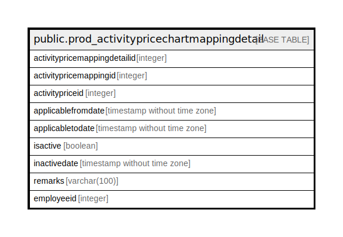

# public.prod_activitypricechartmappingdetail

## Description

## Columns

| Name | Type | Default | Nullable | Children | Parents | Comment |
| ---- | ---- | ------- | -------- | -------- | ------- | ------- |
| activitypricemappingdetailid | integer | nextval('prod_activitypricechartmapping_activitypricemappingdetailid_seq'::regclass) | false |  |  |  |
| activitypricemappingid | integer |  | true |  |  |  |
| activitypriceid | integer |  | true |  |  |  |
| applicablefromdate | timestamp without time zone |  | true |  |  |  |
| applicabletodate | timestamp without time zone |  | true |  |  |  |
| isactive | boolean |  | true |  |  |  |
| inactivedate | timestamp without time zone |  | true |  |  |  |
| remarks | varchar(100) |  | true |  |  |  |
| employeeid | integer | 0 | false |  |  |  |

## Constraints

| Name | Type | Definition |
| ---- | ---- | ---------- |
| prod_activitypricechartmappingdetail_pkey | PRIMARY KEY | PRIMARY KEY (activitypricemappingdetailid) |

## Indexes

| Name | Definition |
| ---- | ---------- |
| prod_activitypricechartmappingdetail_pkey | CREATE UNIQUE INDEX prod_activitypricechartmappingdetail_pkey ON public.prod_activitypricechartmappingdetail USING btree (activitypricemappingdetailid) |

## Relations

---

> Generated by [tbls](https://github.com/k1LoW/tbls)
