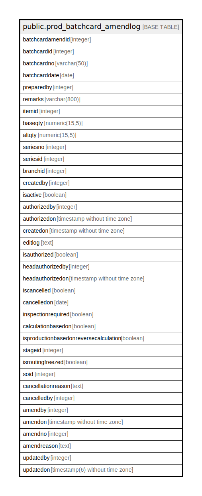

# public.prod_batchcard_amendlog

## Description

## Columns

| Name | Type | Default | Nullable | Children | Parents | Comment |
| ---- | ---- | ------- | -------- | -------- | ------- | ------- |
| batchcardamendid | integer | nextval('prod_batchcard_amendlog_batchcardamendid_seq'::regclass) | false |  |  |  |
| batchcardid | integer |  | true |  |  |  |
| batchcardno | varchar(50) |  | true |  |  |  |
| batchcarddate | date |  | true |  |  |  |
| preparedby | integer |  | true |  |  |  |
| remarks | varchar(800) |  | true |  |  |  |
| itemid | integer |  | true |  |  |  |
| baseqty | numeric(15,5) |  | true |  |  |  |
| altqty | numeric(15,5) |  | true |  |  |  |
| seriesno | integer |  | true |  |  |  |
| seriesid | integer |  | true |  |  |  |
| branchid | integer |  | true |  |  |  |
| createdby | integer |  | true |  |  |  |
| isactive | boolean | true | true |  |  |  |
| authorizedby | integer |  | true |  |  |  |
| authorizedon | timestamp without time zone |  | true |  |  |  |
| createdon | timestamp without time zone | now() | true |  |  |  |
| editlog | text |  | true |  |  |  |
| isauthorized | boolean | false | true |  |  |  |
| headauthorizedby | integer |  | true |  |  |  |
| headauthorizedon | timestamp without time zone |  | true |  |  |  |
| iscancelled | boolean | false | true |  |  |  |
| cancelledon | date |  | true |  |  |  |
| inspectionrequired | boolean | false | true |  |  |  |
| calculationbasedon | boolean | true | true |  |  |  |
| isproductionbasedonreversecalculation | boolean | false | true |  |  |  |
| stageid | integer |  | true |  |  |  |
| isroutingfreezed | boolean | false | true |  |  |  |
| soid | integer |  | true |  |  |  |
| cancellationreason | text |  | true |  |  |  |
| cancelledby | integer |  | true |  |  |  |
| amendby | integer |  | true |  |  |  |
| amendon | timestamp without time zone |  | true |  |  |  |
| amendno | integer |  | true |  |  |  |
| amendreason | text |  | true |  |  |  |
| updatedby | integer |  | true |  |  |  |
| updatedon | timestamp(6) without time zone | NULL::timestamp without time zone | true |  |  |  |

## Constraints

| Name | Type | Definition |
| ---- | ---- | ---------- |
| prod_batchcard_amendlog_pkey | PRIMARY KEY | PRIMARY KEY (batchcardamendid) |

## Indexes

| Name | Definition |
| ---- | ---------- |
| prod_batchcard_amendlog_pkey | CREATE UNIQUE INDEX prod_batchcard_amendlog_pkey ON public.prod_batchcard_amendlog USING btree (batchcardamendid) |

## Relations

---

> Generated by [tbls](https://github.com/k1LoW/tbls)
