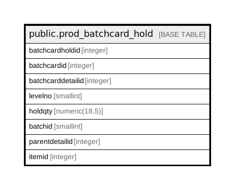

# public.prod_batchcard_hold

## Description

## Columns

| Name | Type | Default | Nullable | Children | Parents | Comment |
| ---- | ---- | ------- | -------- | -------- | ------- | ------- |
| batchcardholdid | integer | nextval('prod_batchcard_hold_batchcardholdid_seq'::regclass) | false |  |  |  |
| batchcardid | integer |  | true |  |  |  |
| batchcarddetailid | integer |  | true |  |  |  |
| levelno | smallint |  | true |  |  |  |
| holdqty | numeric(18,5) |  | true |  |  |  |
| batchid | smallint |  | true |  |  |  |
| parentdetailid | integer |  | true |  |  |  |
| itemid | integer |  | true |  |  |  |

## Constraints

| Name | Type | Definition |
| ---- | ---- | ---------- |
| prod_batchcard_hold_pkey | PRIMARY KEY | PRIMARY KEY (batchcardholdid) |

## Indexes

| Name | Definition |
| ---- | ---------- |
| prod_batchcard_hold_pkey | CREATE UNIQUE INDEX prod_batchcard_hold_pkey ON public.prod_batchcard_hold USING btree (batchcardholdid) |

## Relations

---

> Generated by [tbls](https://github.com/k1LoW/tbls)
