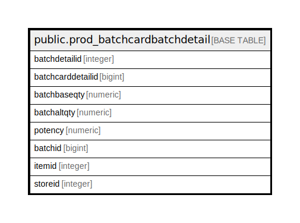

# public.prod_batchcardbatchdetail

## Description

## Columns

| Name | Type | Default | Nullable | Children | Parents | Comment |
| ---- | ---- | ------- | -------- | -------- | ------- | ------- |
| batchdetailid | integer | nextval('prod_batchcardbatchdetail_batchdetailid_seq'::regclass) | false |  |  |  |
| batchcarddetailid | bigint |  | true |  |  |  |
| batchbaseqty | numeric |  | true |  |  |  |
| batchaltqty | numeric |  | true |  |  |  |
| potency | numeric |  | true |  |  |  |
| batchid | bigint |  | true |  |  |  |
| itemid | integer | 0 | false |  |  |  |
| storeid | integer | 0 | false |  |  |  |

## Constraints

| Name | Type | Definition |
| ---- | ---- | ---------- |
| prod_batchcardbatchdetail_pkey | PRIMARY KEY | PRIMARY KEY (batchdetailid) |

## Indexes

| Name | Definition |
| ---- | ---------- |
| prod_batchcardbatchdetail_pkey | CREATE UNIQUE INDEX prod_batchcardbatchdetail_pkey ON public.prod_batchcardbatchdetail USING btree (batchdetailid) |

## Triggers

| Name | Definition |
| ---- | ---------- |
| prod_batchcardbatchdetail_stkcheck | CREATE TRIGGER prod_batchcardbatchdetail_stkcheck BEFORE INSERT OR UPDATE ON public.prod_batchcardbatchdetail FOR EACH ROW EXECUTE FUNCTION tgr_checkholdstock() |

## Relations

---

> Generated by [tbls](https://github.com/k1LoW/tbls)
