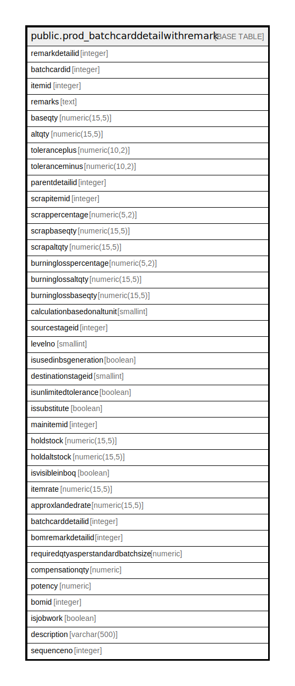

# public.prod_batchcarddetailwithremark

## Description

## Columns

| Name | Type | Default | Nullable | Children | Parents | Comment |
| ---- | ---- | ------- | -------- | -------- | ------- | ------- |
| remarkdetailid | integer | nextval('prod_batchcarddetailwithremark_remarkdetailid_seq'::regclass) | false |  |  |  |
| batchcardid | integer |  | true |  |  |  |
| itemid | integer |  | true |  |  |  |
| remarks | text |  | true |  |  |  |
| baseqty | numeric(15,5) |  | true |  |  |  |
| altqty | numeric(15,5) |  | true |  |  |  |
| toleranceplus | numeric(10,2) |  | true |  |  |  |
| toleranceminus | numeric(10,2) |  | true |  |  |  |
| parentdetailid | integer |  | true |  |  |  |
| scrapitemid | integer |  | true |  |  |  |
| scrappercentage | numeric(5,2) |  | true |  |  |  |
| scrapbaseqty | numeric(15,5) |  | true |  |  |  |
| scrapaltqty | numeric(15,5) |  | true |  |  |  |
| burninglosspercentage | numeric(5,2) |  | true |  |  |  |
| burninglossaltqty | numeric(15,5) |  | true |  |  |  |
| burninglossbaseqty | numeric(15,5) |  | true |  |  |  |
| calculationbasedonaltunit | smallint |  | true |  |  |  |
| sourcestageid | integer |  | true |  |  |  |
| levelno | smallint | 0 | true |  |  |  |
| isusedinbsgeneration | boolean | false | true |  |  | Used in production to produce serial or batch of produced item against the consumption |
| destinationstageid | smallint |  | true |  |  |  |
| isunlimitedtolerance | boolean | false | true |  |  |  |
| issubstitute | boolean | false | true |  |  |  |
| mainitemid | integer |  | true |  |  |  |
| holdstock | numeric(15,5) |  | true |  |  |  |
| holdaltstock | numeric(15,5) |  | true |  |  |  |
| isvisibleinboq | boolean | false | true |  |  |  |
| itemrate | numeric(15,5) |  | true |  |  |  |
| approxlandedrate | numeric(15,5) |  | true |  |  |  |
| batchcarddetailid | integer |  | true |  |  |  |
| bomremarkdetailid | integer |  | true |  |  |  |
| requiredqtyasperstandardbatchsize | numeric |  | true |  |  |  |
| compensationqty | numeric |  | true |  |  |  |
| potency | numeric |  | true |  |  |  |
| bomid | integer |  | true |  |  |  |
| isjobwork | boolean | false | true |  |  |  |
| description | varchar(500) | NULL::character varying | true |  |  |  |
| sequenceno | integer |  | true |  |  |  |

## Constraints

| Name | Type | Definition |
| ---- | ---- | ---------- |
| prod_batchcarddetailwithremark_pkey | PRIMARY KEY | PRIMARY KEY (remarkdetailid) |

## Indexes

| Name | Definition |
| ---- | ---------- |
| prod_batchcarddetailwithremark_pkey | CREATE UNIQUE INDEX prod_batchcarddetailwithremark_pkey ON public.prod_batchcarddetailwithremark USING btree (remarkdetailid) |
| Index_BC_RmkDet_BCID | CREATE INDEX "Index_BC_RmkDet_BCID" ON public.prod_batchcarddetailwithremark USING btree (batchcardid) |

## Relations

---

> Generated by [tbls](https://github.com/k1LoW/tbls)
