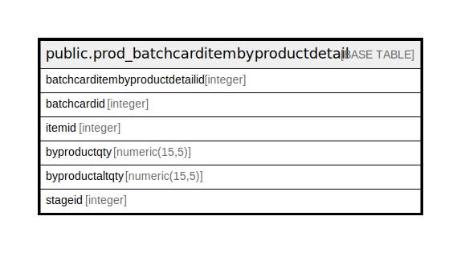

# public.prod_batchcarditembyproductdetail

## Description

## Columns

| Name | Type | Default | Nullable | Children | Parents | Comment |
| ---- | ---- | ------- | -------- | -------- | ------- | ------- |
| batchcarditembyproductdetailid | integer | nextval('prod_batchcarditembyproductde_batchcarditembyproductdetaili_seq'::regclass) | false |  |  |  |
| batchcardid | integer |  | true |  |  |  |
| itemid | integer |  | true |  |  |  |
| byproductqty | numeric(15,5) |  | true |  |  |  |
| byproductaltqty | numeric(15,5) |  | true |  |  |  |
| stageid | integer |  | true |  |  |  |

## Constraints

| Name | Type | Definition |
| ---- | ---- | ---------- |
| prod_batchcarditembyproductdetail_pkey | PRIMARY KEY | PRIMARY KEY (batchcarditembyproductdetailid) |

## Indexes

| Name | Definition |
| ---- | ---------- |
| prod_batchcarditembyproductdetail_pkey | CREATE UNIQUE INDEX prod_batchcarditembyproductdetail_pkey ON public.prod_batchcarditembyproductdetail USING btree (batchcarditembyproductdetailid) |

## Relations

---

> Generated by [tbls](https://github.com/k1LoW/tbls)
