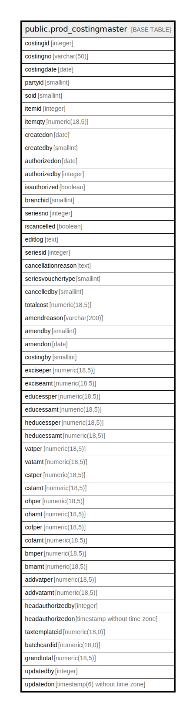

# public.prod_costingmaster

## Description

## Columns

| Name | Type | Default | Nullable | Children | Parents | Comment |
| ---- | ---- | ------- | -------- | -------- | ------- | ------- |
| costingid | integer | nextval('prod_costingmaster_costingid_seq'::regclass) | false |  |  |  |
| costingno | varchar(50) |  | false |  |  |  |
| costingdate | date |  | false |  |  |  |
| partyid | smallint |  | false |  |  |  |
| soid | smallint |  | false |  |  |  |
| itemid | integer |  | false |  |  |  |
| itemqty | numeric(18,5) |  | true |  |  |  |
| createdon | date |  | true |  |  |  |
| createdby | smallint |  | true |  |  |  |
| authorizedon | date |  | true |  |  |  |
| authorizedby | integer |  | true |  |  |  |
| isauthorized | boolean |  | true |  |  |  |
| branchid | smallint |  | false |  |  |  |
| seriesno | integer |  | true |  |  |  |
| iscancelled | boolean | false | true |  |  |  |
| editlog | text |  | true |  |  |  |
| seriesid | integer |  | true |  |  |  |
| cancellationreason | text |  | true |  |  |  |
| seriesvouchertype | smallint | 0 | true |  |  |  |
| cancelledby | smallint |  | true |  |  |  |
| totalcost | numeric(18,5) | 0 | true |  |  |  |
| amendreason | varchar(200) |  | true |  |  |  |
| amendby | smallint |  | true |  |  |  |
| amendon | date |  | true |  |  |  |
| costingby | smallint |  | true |  |  |  |
| exciseper | numeric(18,5) |  | true |  |  |  |
| exciseamt | numeric(18,5) |  | true |  |  |  |
| educessper | numeric(18,5) |  | true |  |  |  |
| educessamt | numeric(18,5) |  | true |  |  |  |
| heducessper | numeric(18,5) |  | true |  |  |  |
| heducessamt | numeric(18,5) |  | true |  |  |  |
| vatper | numeric(18,5) |  | true |  |  |  |
| vatamt | numeric(18,5) |  | true |  |  |  |
| cstper | numeric(18,5) |  | true |  |  |  |
| cstamt | numeric(18,5) |  | true |  |  |  |
| ohper | numeric(18,5) |  | true |  |  |  |
| ohamt | numeric(18,5) |  | true |  |  |  |
| cofper | numeric(18,5) |  | true |  |  |  |
| cofamt | numeric(18,5) |  | true |  |  |  |
| bmper | numeric(18,5) |  | true |  |  |  |
| bmamt | numeric(18,5) |  | true |  |  |  |
| addvatper | numeric(18,5) |  | true |  |  |  |
| addvatamt | numeric(18,5) |  | true |  |  |  |
| headauthorizedby | integer |  | true |  |  |  |
| headauthorizedon | timestamp without time zone |  | true |  |  |  |
| taxtemplateid | numeric(18,0) |  | true |  |  |  |
| batchcardid | numeric(18,0) | 0 | true |  |  |  |
| grandtotal | numeric(18,5) | 0 | true |  |  |  |
| updatedby | integer |  | true |  |  |  |
| updatedon | timestamp(6) without time zone | NULL::timestamp without time zone | true |  |  |  |

## Constraints

| Name | Type | Definition |
| ---- | ---- | ---------- |
| prod_costingmaster_pkey | PRIMARY KEY | PRIMARY KEY (costingid) |

## Indexes

| Name | Definition |
| ---- | ---------- |
| prod_costingmaster_pkey | CREATE UNIQUE INDEX prod_costingmaster_pkey ON public.prod_costingmaster USING btree (costingid) |

## Relations

---

> Generated by [tbls](https://github.com/k1LoW/tbls)
