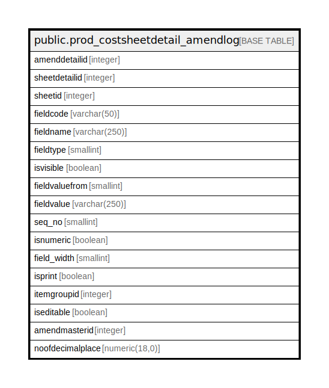

# public.prod_costsheetdetail_amendlog

## Description

## Columns

| Name | Type | Default | Nullable | Children | Parents | Comment |
| ---- | ---- | ------- | -------- | -------- | ------- | ------- |
| amenddetailid | integer | nextval('prod_costsheetdetail_amendlog_amenddetailid_seq'::regclass) | false |  |  |  |
| sheetdetailid | integer |  | false |  |  |  |
| sheetid | integer |  | true |  |  |  |
| fieldcode | varchar(50) |  | true |  |  |  |
| fieldname | varchar(250) |  | false |  |  |  |
| fieldtype | smallint |  | true |  |  |  |
| isvisible | boolean |  | true |  |  |  |
| fieldvaluefrom | smallint |  | true |  |  |  |
| fieldvalue | varchar(250) |  | true |  |  |  |
| seq_no | smallint |  | true |  |  |  |
| isnumeric | boolean |  | true |  |  |  |
| field_width | smallint | 70 | true |  |  |  |
| isprint | boolean | false | true |  |  |  |
| itemgroupid | integer | 0 | true |  |  |  |
| iseditable | boolean | true | true |  |  |  |
| amendmasterid | integer |  | true |  |  |  |
| noofdecimalplace | numeric(18,0) | 2 | true |  |  |  |

## Relations

---

> Generated by [tbls](https://github.com/k1LoW/tbls)
