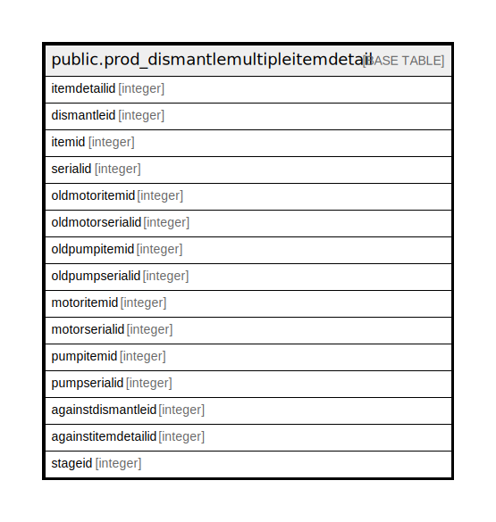

# public.prod_dismantlemultipleitemdetail

## Description

## Columns

| Name | Type | Default | Nullable | Children | Parents | Comment |
| ---- | ---- | ------- | -------- | -------- | ------- | ------- |
| itemdetailid | integer | nextval('prod_dismantlemultipleitemdetail_itemdetailid_seq'::regclass) | false |  |  |  |
| dismantleid | integer |  | true |  |  |  |
| itemid | integer |  | true |  |  |  |
| serialid | integer |  | true |  |  |  |
| oldmotoritemid | integer |  | true |  |  |  |
| oldmotorserialid | integer |  | true |  |  |  |
| oldpumpitemid | integer |  | true |  |  |  |
| oldpumpserialid | integer |  | true |  |  |  |
| motoritemid | integer |  | true |  |  |  |
| motorserialid | integer |  | true |  |  |  |
| pumpitemid | integer |  | true |  |  |  |
| pumpserialid | integer |  | true |  |  |  |
| againstdismantleid | integer |  | true |  |  |  |
| againstitemdetailid | integer |  | true |  |  |  |
| stageid | integer |  | true |  |  |  |

## Constraints

| Name | Type | Definition |
| ---- | ---- | ---------- |
| prod_dismantlemultipleitemdetail_pkey | PRIMARY KEY | PRIMARY KEY (itemdetailid) |

## Indexes

| Name | Definition |
| ---- | ---------- |
| prod_dismantlemultipleitemdetail_pkey | CREATE UNIQUE INDEX prod_dismantlemultipleitemdetail_pkey ON public.prod_dismantlemultipleitemdetail USING btree (itemdetailid) |

## Relations

---

> Generated by [tbls](https://github.com/k1LoW/tbls)
