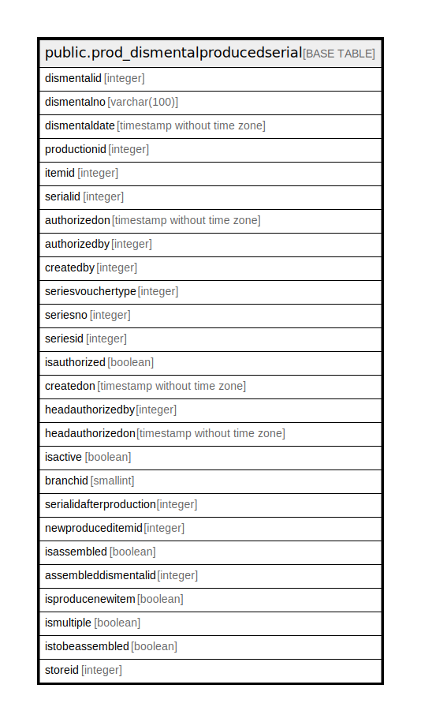

# public.prod_dismentalproducedserial

## Description

## Columns

| Name | Type | Default | Nullable | Children | Parents | Comment |
| ---- | ---- | ------- | -------- | -------- | ------- | ------- |
| dismentalid | integer | nextval('prod_dismentalproducedserial_dismentalid_seq'::regclass) | false |  |  |  |
| dismentalno | varchar(100) |  | true |  |  |  |
| dismentaldate | timestamp without time zone |  | true |  |  |  |
| productionid | integer |  | true |  |  |  |
| itemid | integer |  | true |  |  |  |
| serialid | integer |  | true |  |  |  |
| authorizedon | timestamp without time zone |  | true |  |  |  |
| authorizedby | integer |  | true |  |  |  |
| createdby | integer |  | true |  |  |  |
| seriesvouchertype | integer |  | true |  |  |  |
| seriesno | integer |  | true |  |  |  |
| seriesid | integer |  | true |  |  |  |
| isauthorized | boolean | false | true |  |  |  |
| createdon | timestamp without time zone | now() | true |  |  |  |
| headauthorizedby | integer |  | true |  |  |  |
| headauthorizedon | timestamp without time zone |  | true |  |  |  |
| isactive | boolean | false | true |  |  |  |
| branchid | smallint |  | true |  |  |  |
| serialidafterproduction | integer |  | true |  |  |  |
| newproduceditemid | integer |  | true |  |  |  |
| isassembled | boolean | false | true |  |  | true which is created by Assemble of Dismantled Serial form |
| assembleddismentalid | integer |  | true |  |  | dismentalid which is assembled by Assemble of Dismantled Serial form |
| isproducenewitem | boolean | false | true |  |  |  |
| ismultiple | boolean | false | true |  |  |  |
| istobeassembled | boolean | false | true |  |  |  |
| storeid | integer |  | true |  |  |  |

## Constraints

| Name | Type | Definition |
| ---- | ---- | ---------- |
| prod_dismentalproducedserial_pkey | PRIMARY KEY | PRIMARY KEY (dismentalid) |

## Indexes

| Name | Definition |
| ---- | ---------- |
| prod_dismentalproducedserial_pkey | CREATE UNIQUE INDEX prod_dismentalproducedserial_pkey ON public.prod_dismentalproducedserial USING btree (dismentalid) |

## Relations

---

> Generated by [tbls](https://github.com/k1LoW/tbls)
