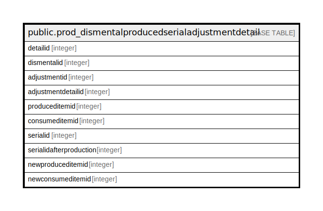

# public.prod_dismentalproducedserialadjustmentdetail

## Description

## Columns

| Name | Type | Default | Nullable | Children | Parents | Comment |
| ---- | ---- | ------- | -------- | -------- | ------- | ------- |
| detailid | integer | nextval('prod_dismentalproducedserialadjustmentdetail_detailid_seq'::regclass) | false |  |  |  |
| dismentalid | integer |  | true |  |  |  |
| adjustmentid | integer |  | true |  |  |  |
| adjustmentdetailid | integer |  | true |  |  |  |
| produceditemid | integer |  | true |  |  |  |
| consumeditemid | integer |  | true |  |  |  |
| serialid | integer |  | true |  |  |  |
| serialidafterproduction | integer |  | true |  |  |  |
| newproduceditemid | integer |  | true |  |  |  |
| newconsumeditemid | integer |  | true |  |  |  |

## Constraints

| Name | Type | Definition |
| ---- | ---- | ---------- |
| prod_dismentalproducedserialadjustmentdetail_pkey | PRIMARY KEY | PRIMARY KEY (detailid) |

## Indexes

| Name | Definition |
| ---- | ---------- |
| prod_dismentalproducedserialadjustmentdetail_pkey | CREATE UNIQUE INDEX prod_dismentalproducedserialadjustmentdetail_pkey ON public.prod_dismentalproducedserialadjustmentdetail USING btree (detailid) |

## Relations

---

> Generated by [tbls](https://github.com/k1LoW/tbls)
