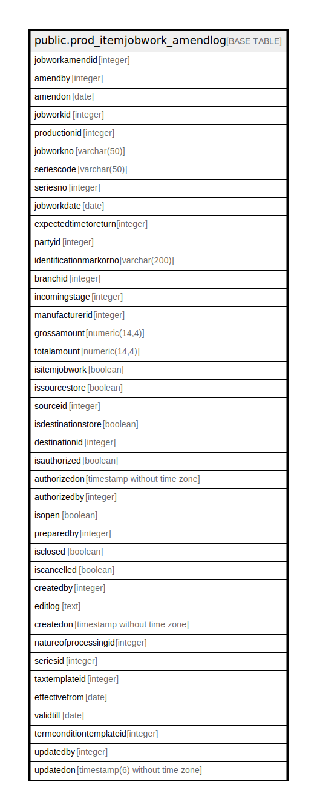

# public.prod_itemjobwork_amendlog

## Description

## Columns

| Name | Type | Default | Nullable | Children | Parents | Comment |
| ---- | ---- | ------- | -------- | -------- | ------- | ------- |
| jobworkamendid | integer | nextval('prod_itemjobwork_amendlog_jobworkamendid_seq'::regclass) | false |  |  |  |
| amendby | integer |  | true |  |  |  |
| amendon | date |  | true |  |  |  |
| jobworkid | integer |  | true |  |  |  |
| productionid | integer |  | true |  |  |  |
| jobworkno | varchar(50) |  | true |  |  |  |
| seriescode | varchar(50) |  | true |  |  |  |
| seriesno | integer |  | true |  |  |  |
| jobworkdate | date |  | true |  |  |  |
| expectedtimetoreturn | integer |  | true |  |  |  |
| partyid | integer |  | true |  |  |  |
| identificationmarkorno | varchar(200) |  | true |  |  |  |
| branchid | integer |  | true |  |  |  |
| incomingstage | integer |  | true |  |  |  |
| manufacturerid | integer |  | true |  |  |  |
| grossamount | numeric(14,4) |  | true |  |  |  |
| totalamount | numeric(14,4) |  | true |  |  |  |
| isitemjobwork | boolean |  | true |  |  |  |
| issourcestore | boolean | false | true |  |  |  |
| sourceid | integer |  | true |  |  |  |
| isdestinationstore | boolean |  | true |  |  |  |
| destinationid | integer |  | true |  |  |  |
| isauthorized | boolean | false | false |  |  |  |
| authorizedon | timestamp without time zone |  | true |  |  |  |
| authorizedby | integer |  | true |  |  |  |
| isopen | boolean | false | true |  |  |  |
| preparedby | integer |  | true |  |  |  |
| isclosed | boolean | false | true |  |  |  |
| iscancelled | boolean | false | true |  |  |  |
| createdby | integer |  | true |  |  |  |
| editlog | text |  | true |  |  |  |
| createdon | timestamp without time zone | now() | true |  |  |  |
| natureofprocessingid | integer |  | true |  |  |  |
| seriesid | integer |  | true |  |  |  |
| taxtemplateid | integer |  | true |  |  |  |
| effectivefrom | date |  | true |  |  |  |
| validtill | date |  | true |  |  |  |
| termconditiontemplateid | integer |  | true |  |  |  |
| updatedby | integer |  | true |  |  |  |
| updatedon | timestamp(6) without time zone | NULL::timestamp without time zone | true |  |  |  |

## Constraints

| Name | Type | Definition |
| ---- | ---- | ---------- |
| prod_itemjobwork_amendlog_pkey | PRIMARY KEY | PRIMARY KEY (jobworkamendid) |

## Indexes

| Name | Definition |
| ---- | ---------- |
| prod_itemjobwork_amendlog_pkey | CREATE UNIQUE INDEX prod_itemjobwork_amendlog_pkey ON public.prod_itemjobwork_amendlog USING btree (jobworkamendid) |

## Relations

---

> Generated by [tbls](https://github.com/k1LoW/tbls)
