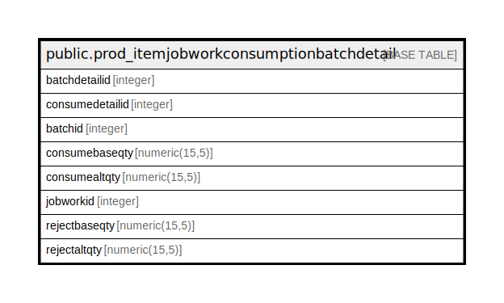

# public.prod_itemjobworkconsumptionbatchdetail

## Description

## Columns

| Name | Type | Default | Nullable | Children | Parents | Comment |
| ---- | ---- | ------- | -------- | -------- | ------- | ------- |
| batchdetailid | integer | nextval('prod_itemjobworkconsumptionbatchdetail_batchdetailid_seq'::regclass) | false |  |  |  |
| consumedetailid | integer |  | true |  |  |  |
| batchid | integer |  | true |  |  |  |
| consumebaseqty | numeric(15,5) |  | true |  |  |  |
| consumealtqty | numeric(15,5) |  | true |  |  |  |
| jobworkid | integer |  | true |  |  |  |
| rejectbaseqty | numeric(15,5) |  | true |  |  |  |
| rejectaltqty | numeric(15,5) |  | true |  |  |  |

## Constraints

| Name | Type | Definition |
| ---- | ---- | ---------- |
| prod_itemjobworkconsumptionbatchdetail_pkey | PRIMARY KEY | PRIMARY KEY (batchdetailid) |

## Indexes

| Name | Definition |
| ---- | ---------- |
| prod_itemjobworkconsumptionbatchdetail_pkey | CREATE UNIQUE INDEX prod_itemjobworkconsumptionbatchdetail_pkey ON public.prod_itemjobworkconsumptionbatchdetail USING btree (batchdetailid) |

## Triggers

| Name | Definition |
| ---- | ---------- |
| itemjobworkconsumptionbatchdetail_trg_checkstock | CREATE TRIGGER itemjobworkconsumptionbatchdetail_trg_checkstock BEFORE INSERT OR UPDATE ON public.prod_itemjobworkconsumptionbatchdetail FOR EACH ROW EXECUTE FUNCTION trg_checkstock() |

## Relations

---

> Generated by [tbls](https://github.com/k1LoW/tbls)
