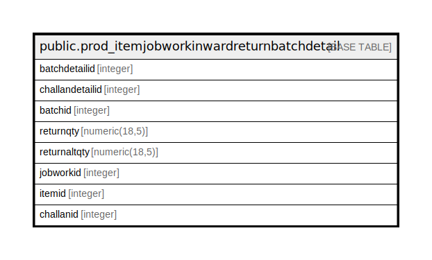

# public.prod_itemjobworkinwardreturnbatchdetail

## Description

## Columns

| Name | Type | Default | Nullable | Children | Parents | Comment |
| ---- | ---- | ------- | -------- | -------- | ------- | ------- |
| batchdetailid | integer | nextval('prod_itemjobworkinwardreturnbatchdetail_batchdetailid_seq'::regclass) | false |  |  |  |
| challandetailid | integer |  | true |  |  |  |
| batchid | integer |  | true |  |  |  |
| returnqty | numeric(18,5) |  | true |  |  |  |
| returnaltqty | numeric(18,5) |  | true |  |  |  |
| jobworkid | integer |  | true |  |  |  |
| itemid | integer |  | true |  |  |  |
| challanid | integer |  | true |  |  |  |

## Constraints

| Name | Type | Definition |
| ---- | ---- | ---------- |
| prod_itemjobworkinwardreturnbatchdetail_pkey | PRIMARY KEY | PRIMARY KEY (batchdetailid) |

## Indexes

| Name | Definition |
| ---- | ---------- |
| prod_itemjobworkinwardreturnbatchdetail_pkey | CREATE UNIQUE INDEX prod_itemjobworkinwardreturnbatchdetail_pkey ON public.prod_itemjobworkinwardreturnbatchdetail USING btree (batchdetailid) |

## Relations

---

> Generated by [tbls](https://github.com/k1LoW/tbls)
