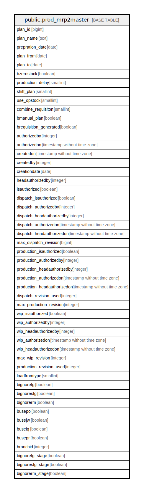

# public.prod_mrp2master

## Description

## Columns

| Name | Type | Default | Nullable | Children | Parents | Comment |
| ---- | ---- | ------- | -------- | -------- | ------- | ------- |
| plan_id | bigint | nextval('prod_mrp2master_plan_id_seq'::regclass) | false |  |  |  |
| plan_name | text |  | false |  |  |  |
| prepration_date | date |  | false |  |  |  |
| plan_from | date |  | false |  |  |  |
| plan_to | date |  | false |  |  |  |
| bzerostock | boolean | false | false |  |  |  |
| production_delay | smallint |  | false |  |  |  |
| shift_plan | smallint |  | true |  |  |  |
| use_opstock | smallint |  | true |  |  |  |
| combine_requisiton | smallint |  | true |  |  |  |
| bmanual_plan | boolean | false | true |  |  |  |
| brequisition_generated | boolean | false | true |  |  |  |
| authorizedby | integer |  | true |  |  |  |
| authorizedon | timestamp without time zone |  | true |  |  |  |
| createdon | timestamp without time zone |  | true |  |  |  |
| createdby | integer |  | true |  |  |  |
| creationdate | date |  | true |  |  |  |
| headauthorizedby | integer |  | true |  |  |  |
| isauthorized | boolean |  | true |  |  |  |
| dispatch_isauthorized | boolean | false | true |  |  |  |
| dispatch_authorizedby | integer |  | true |  |  |  |
| dispatch_headauthorizedby | integer |  | true |  |  |  |
| dispatch_authorizedon | timestamp without time zone |  | true |  |  |  |
| dispatch_headauthorizedon | timestamp without time zone |  | true |  |  |  |
| max_dispatch_revision | bigint | '-1'::integer | true |  |  |  |
| production_isauthorized | boolean | false | true |  |  |  |
| production_authorizedby | integer |  | true |  |  |  |
| production_headauthorizedby | integer |  | true |  |  |  |
| production_authorizedon | timestamp without time zone |  | true |  |  |  |
| production_headauthorizedon | timestamp without time zone |  | true |  |  |  |
| dispatch_revision_used | integer |  | true |  |  |  |
| max_production_revision | integer | '-1'::integer | true |  |  |  |
| wip_isauthorized | boolean | false | true |  |  |  |
| wip_authorizedby | integer |  | true |  |  |  |
| wip_headauthorizedby | integer |  | true |  |  |  |
| wip_authorizedon | timestamp without time zone |  | true |  |  |  |
| wip_headauthorizedon | timestamp without time zone |  | true |  |  |  |
| max_wip_revision | integer | '-1'::integer | true |  |  |  |
| production_revision_used | integer |  | true |  |  |  |
| loadfromtype | smallint | 0 | true |  |  | 0 - Load from Schedule 1 - Load from Production Plan |
| bignorefg | boolean | false | true |  |  |  |
| bignoresfg | boolean | false | true |  |  |  |
| bignorerm | boolean | false | true |  |  |  |
| busepo | boolean | false | true |  |  |  |
| busejw | boolean | false | true |  |  |  |
| buseiq | boolean | false | true |  |  |  |
| busepr | boolean | false | true |  |  |  |
| branchid | integer |  | true |  |  |  |
| bignorefg_stage | boolean | false | true |  |  |  |
| bignoresfg_stage | boolean | false | true |  |  |  |
| bignorerm_stage | boolean | false | true |  |  |  |

## Constraints

| Name | Type | Definition |
| ---- | ---- | ---------- |
| prod_mrp2master_pkey | PRIMARY KEY | PRIMARY KEY (plan_id) |

## Indexes

| Name | Definition |
| ---- | ---------- |
| prod_mrp2master_pkey | CREATE UNIQUE INDEX prod_mrp2master_pkey ON public.prod_mrp2master USING btree (plan_id) |

## Relations

---

> Generated by [tbls](https://github.com/k1LoW/tbls)
