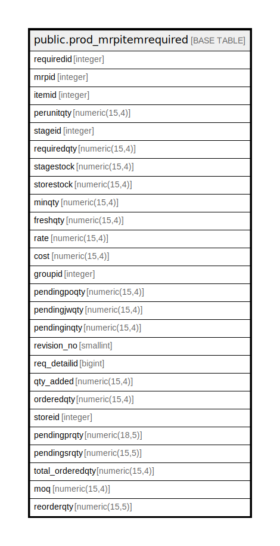

# public.prod_mrpitemrequired

## Description

## Columns

| Name | Type | Default | Nullable | Children | Parents | Comment |
| ---- | ---- | ------- | -------- | -------- | ------- | ------- |
| requiredid | integer | nextval('prod_mrpitemrequired_requiredid_seq'::regclass) | false |  |  |  |
| mrpid | integer |  | true |  |  |  |
| itemid | integer |  | true |  |  |  |
| perunitqty | numeric(15,4) |  | true |  |  |  |
| stageid | integer |  | true |  |  |  |
| requiredqty | numeric(15,4) |  | true |  |  |  |
| stagestock | numeric(15,4) |  | true |  |  |  |
| storestock | numeric(15,4) |  | true |  |  |  |
| minqty | numeric(15,4) |  | true |  |  |  |
| freshqty | numeric(15,4) |  | true |  |  |  |
| rate | numeric(15,4) |  | true |  |  |  |
| cost | numeric(15,4) |  | true |  |  |  |
| groupid | integer |  | true |  |  |  |
| pendingpoqty | numeric(15,4) |  | true |  |  |  |
| pendingjwqty | numeric(15,4) | 0 | true |  |  |  |
| pendinginqty | numeric(15,4) | 0 | true |  |  |  |
| revision_no | smallint |  | true |  |  |  |
| req_detailid | bigint |  | true |  |  |  |
| qty_added | numeric(15,4) |  | true |  |  |  |
| orderedqty | numeric(15,4) | 0 | true |  |  |  |
| storeid | integer |  | true |  |  |  |
| pendingprqty | numeric(18,5) |  | true |  |  |  |
| pendingsrqty | numeric(15,5) |  | true |  |  |  |
| total_orderedqty | numeric(15,4) | 0 | true |  |  |  |
| moq | numeric(15,4) | 0 | true |  |  |  |
| reorderqty | numeric(15,5) | 0 | true |  |  |  |

## Constraints

| Name | Type | Definition |
| ---- | ---- | ---------- |
| prod_mrpitemrequired_pkey | PRIMARY KEY | PRIMARY KEY (requiredid) |

## Indexes

| Name | Definition |
| ---- | ---------- |
| prod_mrpitemrequired_pkey | CREATE UNIQUE INDEX prod_mrpitemrequired_pkey ON public.prod_mrpitemrequired USING btree (requiredid) |

## Relations

---

> Generated by [tbls](https://github.com/k1LoW/tbls)
