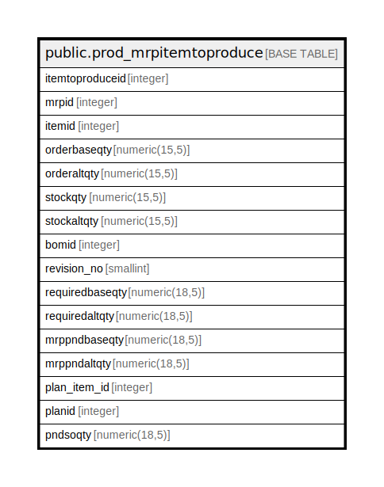

# public.prod_mrpitemtoproduce

## Description

## Columns

| Name | Type | Default | Nullable | Children | Parents | Comment |
| ---- | ---- | ------- | -------- | -------- | ------- | ------- |
| itemtoproduceid | integer | nextval('prod_mrpitemtoproduce_itemtoproduceid_seq'::regclass) | false |  |  |  |
| mrpid | integer |  | true |  |  |  |
| itemid | integer |  | true |  |  |  |
| orderbaseqty | numeric(15,5) |  | true |  |  |  |
| orderaltqty | numeric(15,5) |  | true |  |  |  |
| stockqty | numeric(15,5) |  | true |  |  |  |
| stockaltqty | numeric(15,5) |  | true |  |  |  |
| bomid | integer |  | true |  |  |  |
| revision_no | smallint |  | true |  |  |  |
| requiredbaseqty | numeric(18,5) |  | true |  |  |  |
| requiredaltqty | numeric(18,5) |  | true |  |  |  |
| mrppndbaseqty | numeric(18,5) |  | true |  |  |  |
| mrppndaltqty | numeric(18,5) |  | true |  |  |  |
| plan_item_id | integer |  | true |  |  |  |
| planid | integer |  | true |  |  |  |
| pndsoqty | numeric(18,5) |  | true |  |  |  |

## Constraints

| Name | Type | Definition |
| ---- | ---- | ---------- |
| prod_mrpitemtoproduce_pkey | PRIMARY KEY | PRIMARY KEY (itemtoproduceid) |

## Indexes

| Name | Definition |
| ---- | ---------- |
| prod_mrpitemtoproduce_pkey | CREATE UNIQUE INDEX prod_mrpitemtoproduce_pkey ON public.prod_mrpitemtoproduce USING btree (itemtoproduceid) |

## Relations

---

> Generated by [tbls](https://github.com/k1LoW/tbls)
