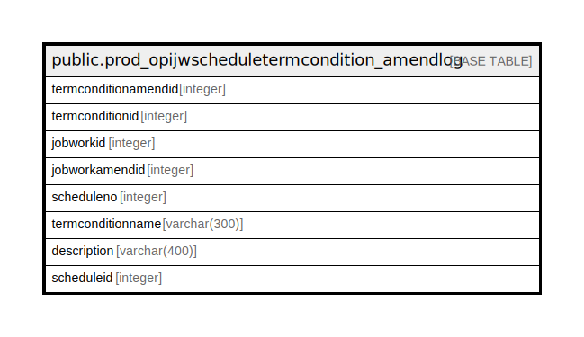

# public.prod_opijwscheduletermcondition_amendlog

## Description

## Columns

| Name | Type | Default | Nullable | Children | Parents | Comment |
| ---- | ---- | ------- | -------- | -------- | ------- | ------- |
| termconditionamendid | integer | nextval('prod_opijwscheduletermcondition_amendl_termconditionamendid_seq'::regclass) | false |  |  |  |
| termconditionid | integer |  | true |  |  |  |
| jobworkid | integer |  | true |  |  |  |
| jobworkamendid | integer |  | true |  |  |  |
| scheduleno | integer |  | true |  |  |  |
| termconditionname | varchar(300) | NULL::character varying | true |  |  |  |
| description | varchar(400) | NULL::character varying | true |  |  |  |
| scheduleid | integer |  | true |  |  |  |

## Constraints

| Name | Type | Definition |
| ---- | ---- | ---------- |
| prod_opijwscheduletermcondition_amendlog_pkey | PRIMARY KEY | PRIMARY KEY (termconditionamendid) |

## Indexes

| Name | Definition |
| ---- | ---------- |
| prod_opijwscheduletermcondition_amendlog_pkey | CREATE UNIQUE INDEX prod_opijwscheduletermcondition_amendlog_pkey ON public.prod_opijwscheduletermcondition_amendlog USING btree (termconditionamendid) |

## Relations

---

> Generated by [tbls](https://github.com/k1LoW/tbls)
