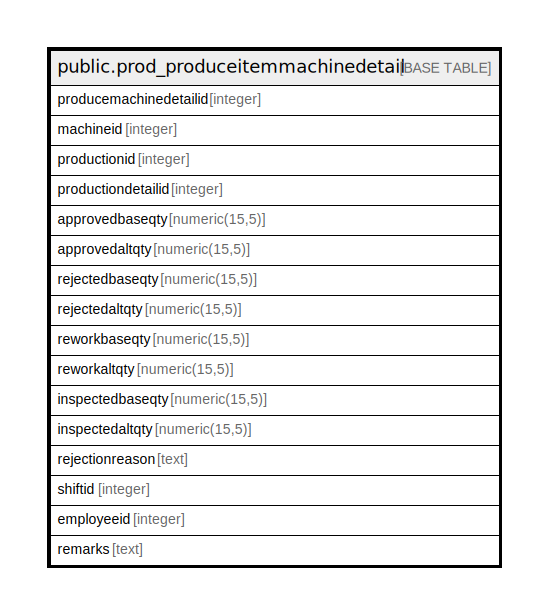

# public.prod_produceitemmachinedetail

## Description

## Columns

| Name | Type | Default | Nullable | Children | Parents | Comment |
| ---- | ---- | ------- | -------- | -------- | ------- | ------- |
| producemachinedetailid | integer | nextval('prod_produceitemmachinedetail_producemachinedetailid_seq'::regclass) | false |  |  |  |
| machineid | integer |  | true |  |  |  |
| productionid | integer |  | true |  |  |  |
| productiondetailid | integer |  | true |  |  |  |
| approvedbaseqty | numeric(15,5) |  | true |  |  |  |
| approvedaltqty | numeric(15,5) |  | true |  |  |  |
| rejectedbaseqty | numeric(15,5) |  | true |  |  |  |
| rejectedaltqty | numeric(15,5) |  | true |  |  |  |
| reworkbaseqty | numeric(15,5) |  | true |  |  |  |
| reworkaltqty | numeric(15,5) |  | true |  |  |  |
| inspectedbaseqty | numeric(15,5) |  | true |  |  |  |
| inspectedaltqty | numeric(15,5) |  | true |  |  |  |
| rejectionreason | text |  | true |  |  |  |
| shiftid | integer |  | true |  |  |  |
| employeeid | integer |  | true |  |  |  |
| remarks | text |  | true |  |  |  |

## Constraints

| Name | Type | Definition |
| ---- | ---- | ---------- |
| prod_produceitemmachinedetail_pkey | PRIMARY KEY | PRIMARY KEY (producemachinedetailid) |

## Indexes

| Name | Definition |
| ---- | ---------- |
| prod_produceitemmachinedetail_pkey | CREATE UNIQUE INDEX prod_produceitemmachinedetail_pkey ON public.prod_produceitemmachinedetail USING btree (producemachinedetailid) |
| Index_PE_MechDet_PEDetID | CREATE INDEX "Index_PE_MechDet_PEDetID" ON public.prod_produceitemmachinedetail USING btree (productiondetailid) |
| Index_PE_MechDet_PIIDPEDetID | CREATE INDEX "Index_PE_MechDet_PIIDPEDetID" ON public.prod_produceitemmachinedetail USING btree (productionid, productiondetailid) |

## Relations

---

> Generated by [tbls](https://github.com/k1LoW/tbls)
