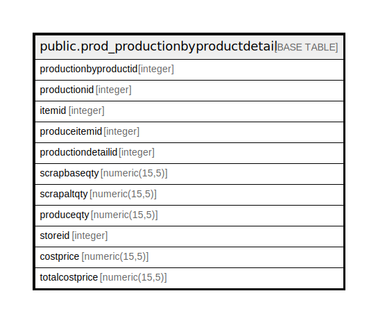

# public.prod_productionbyproductdetail

## Description

## Columns

| Name | Type | Default | Nullable | Children | Parents | Comment |
| ---- | ---- | ------- | -------- | -------- | ------- | ------- |
| productionbyproductid | integer | nextval('prod_productionbyproductdetail_productionbyproductid_seq'::regclass) | false |  |  |  |
| productionid | integer |  | true |  |  |  |
| itemid | integer |  | true |  |  |  |
| produceitemid | integer |  | true |  |  |  |
| productiondetailid | integer |  | true |  |  |  |
| scrapbaseqty | numeric(15,5) |  | true |  |  |  |
| scrapaltqty | numeric(15,5) |  | true |  |  |  |
| produceqty | numeric(15,5) |  | true |  |  |  |
| storeid | integer |  | true |  |  |  |
| costprice | numeric(15,5) |  | true |  |  |  |
| totalcostprice | numeric(15,5) |  | true |  |  |  |

## Constraints

| Name | Type | Definition |
| ---- | ---- | ---------- |
| prod_productionbyproductdetail_pkey | PRIMARY KEY | PRIMARY KEY (productionbyproductid) |

## Indexes

| Name | Definition |
| ---- | ---------- |
| prod_productionbyproductdetail_pkey | CREATE UNIQUE INDEX prod_productionbyproductdetail_pkey ON public.prod_productionbyproductdetail USING btree (productionbyproductid) |
| Index_PE_ByPrDet_PEDetID | CREATE INDEX "Index_PE_ByPrDet_PEDetID" ON public.prod_productionbyproductdetail USING btree (productionid) |

## Relations

---

> Generated by [tbls](https://github.com/k1LoW/tbls)
