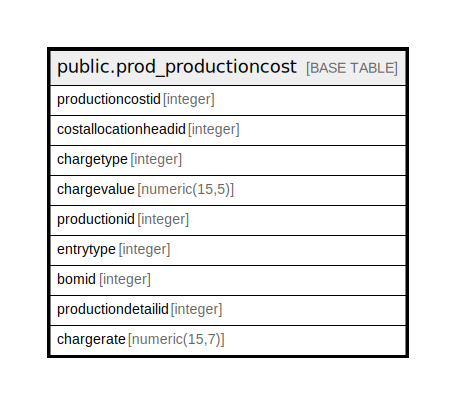

# public.prod_productioncost

## Description

## Columns

| Name | Type | Default | Nullable | Children | Parents | Comment |
| ---- | ---- | ------- | -------- | -------- | ------- | ------- |
| productioncostid | integer | nextval('prod_productioncost_productioncostid_seq'::regclass) | false |  |  |  |
| costallocationheadid | integer |  | true |  |  |  |
| chargetype | integer |  | true |  |  |  |
| chargevalue | numeric(15,5) | 0 | true |  |  |  |
| productionid | integer |  | true |  |  |  |
| entrytype | integer |  | true |  |  | 1 -> Batch Card, 2 -> BOM, 3 -> Production,4 -> ProcessCost |
| bomid | integer |  | true |  |  |  |
| productiondetailid | integer |  | true |  |  |  |
| chargerate | numeric(15,7) | 0 | true |  |  |  |

## Constraints

| Name | Type | Definition |
| ---- | ---- | ---------- |
| prod_productioncost_pkey | PRIMARY KEY | PRIMARY KEY (productioncostid) |

## Indexes

| Name | Definition |
| ---- | ---------- |
| prod_productioncost_pkey | CREATE UNIQUE INDEX prod_productioncost_pkey ON public.prod_productioncost USING btree (productioncostid) |

## Relations

---

> Generated by [tbls](https://github.com/k1LoW/tbls)
